# BuMath LMS - Hệ thống Quản lý Học tập Toán học

> Nền tảng giáo dục trực tuyến chuyên biệt dành cho học sinh THCS (lớp 7-9) và ôn thi chuyên Toán tại Việt Nam.

---

## Mục lục

- [1. Tổng quan dự án](#bumath-lms--project-overview)
  - [1.1 Hướng dẫn bắt đầu](#getting-started--setup--configuration)
  - [1.2 Công nghệ sử dụng](#technology-stack)
  - [1.3 Lộ trình phát triển](#project-roadmap--development-phases)
- [2. Kiến trúc hệ thống](#core-architecture)
  - [2.1 Routing & Application Shell](#routing--application-shell)
  - [2.2 Xác thực & Phân quyền](#authentication--access-control)
  - [2.3 Database Schema & Supabase](#database-schema--supabase-integration)
  - [2.4 API Layer](#api-layer-srclibapi)
- [3. Design System & UI](#design-system--ui)
  - [3.1 BuMath Design Tokens & Claymorphism](#bumath-design-tokens--claymorphism)
  - [3.2 Landing Page Components](#landing-page-components)
  - [3.3 Shared UI Components](#shared-ui-components-shadcnui)
- [4. Tính năng Học sinh](#student-facing-features)
  - [4.1 Danh mục khóa học & Đăng ký](#course-catalogue--enrollment)
  - [4.2 Chi tiết khóa học & Xem bài](#course-detail--lesson-viewing)
  - [4.3 Tiến độ học tập & Nộp bài](#lesson-progress-study-materials--assignment-submission)
  - [4.4 Chat trong bài học](#in-lesson-chat-thảo-luận)
  - [4.5 Thông báo điểm](#grade-notifications-bellnotification)
  - [4.6 Hệ thống thi thử](#mock-exam-system-student-side)
  - [4.7 Thư viện tài liệu](#study-materials-library-tài-liệu--student-view)
  - [4.8 Hồ sơ học sinh & Gói học](#student-profile--learning-packages)
- [5. Tính năng Admin & Giáo viên](#admin--teacher-features)
  - [5.1 Quản lý người dùng](#user-management-userspage)
  - [5.2 Quản lý khóa học](#course-management-coursespage)
  - [5.3 Quản lý chương & bài học](#chapter--lesson-management)
  - [5.4 Chấm bài](#submission-grading-submissionspage--gradingpage)
  - [5.5 Quản lý gói học](#packages-management-packagespage)
  - [5.6 Quản lý đề thi thử](#mock-exam-administration-examsessionspage--examsessiondetailpage)
  - [5.7 Quản lý tài liệu](#study-materials-admin-tailieuadminpage)
- [6. Chiến lược Testing](#testing-strategy)
  - [6.1 Unit & Component Tests](#unit--component-tests)
  - [6.2 Integration & Page-Level Tests](#integration--page-level-tests)
- [7. Hạ tầng & Triển khai](#infrastructure--deployment)
  - [7.1 CI/CD Pipeline & Build](#cicd-pipeline--build)
  - [7.2 Supabase Migrations](#supabase-migrations)
- [8. Thuật ngữ](#glossary)

---

# BuMath LMS — Project Overview

The BuMath Learning Management System (LMS) is a specialized online education platform designed for secondary school students in Vietnam (Grades 7–9) and those preparing for specialized math entrance exams (ôn thi chuyên Toán). 

The system's core value is enabling students to learn at their own pace while receiving personalized, high-quality feedback from instructors on every handwritten assignment, maintaining the quality of 1-on-1 tutoring in an online environment.

## System Personas & Use Cases

| Persona | Primary Activities |
|:---|:---|
| **Student** | Browse course catalogues, watch video lectures, track learning progress, participate in lesson-specific chats, take timed mock exams, and upload photos of handwritten assignments. |
| **Teacher** | Access a grading queue to review student submissions, reply to student questions in real-time, and manage standalone study materials,. |
| **Admin** | Manage user packages/access control, author mock exam sessions with KaTeX, oversee course curriculum, and manage system-wide user approvals. |

## High-Level Architecture

BuMath is built as a Single-Page Application (SPA) using React, leveraging a "Backend-as-a-Service" model with Supabase to minimize server maintenance.

### Conceptual System Flow

The following diagram illustrates how natural language concepts map to specific code entities and data flow:

**BuMath Logic to Code Mapping**
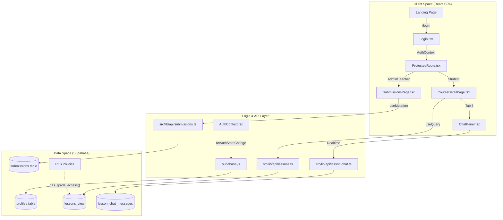

## Technology Stack

The project utilizes a modern frontend stack focused on type safety and rapid UI development.

*   **Frontend**: React 18, Vite, TypeScript.
*   **Styling**: Tailwind CSS with "Claymorphism" (Student) and "Glassmorphism" (Admin/Exam) design languages.
*   **Components**: shadcn/ui and Radix UI primitives.
*   **Data Handling**: TanStack Query for server state and Supabase Realtime for chat.
*   **Math Rendering**: KaTeX for rendering LaTeX in mock exams.
*   **Backend**: Supabase (PostgreSQL, Auth, Storage, and Row Level Security).

For a detailed breakdown of libraries and versions, see [Technology Stack](#1.2).

## Codebase Organization

The repository is organized into a standard React structure with a heavy emphasis on the `src/lib/api` directory for modular backend interactions.

**Source Code Structure**
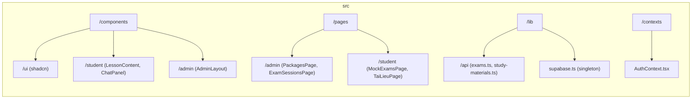

## Project Roadmap

The project has transitioned from an MVP to a full-featured educational platform.

*   **v1.0 MVP**: Established core LMS features: course management, submissions, and grading.
*   **v2.0 UI Refactor**: Standardized Vietnamese URLs and introduced the BuMath design system.
*   **v3.0 Platform Expansion (Current)**: Adding learning packages, in-lesson chat, timed mock exams, and a standalone study materials library.

For details on development phases and milestones, see [Project Roadmap & Development Phases](#1.3).

## Documentation Index

### 1.1 [Getting Started — Setup & Configuration](#1.1)
Step-by-step guide for onboarding developers: cloning the repo, installing dependencies with **Yarn 4**, and configuring Supabase/Google Apps Script environment variables.

### 1.2 [Technology Stack](#1.2)
Detailed reference for every major library used, including React 18, Vite, TanStack Query, Framer Motion, and KaTeX.

### 1.3 [Project Roadmap & Development Phases](#1.3)
Overview of the 21 development phases, current milestone (v3.0 Platform Expansion), and the current state of the Phase 20 UI redesign.

-
-
-
-
-

---

# Getting Started — Setup & Configuration

This page provides a comprehensive guide for developers onboarding to the BuMath LMS project. It covers the technical environment setup, dependency management using Yarn 4, and the configuration of external services like Supabase and Google Apps Script.

## 1. Development Environment Prerequisites

Before starting, ensure your local machine has the following tools installed:
- **Node.js**: Version 18 or higher.
- **Yarn**: Version 4.11.0. The project uses a standard `node_modules` strategy via Yarn 4 (configured via `nodeLinker: node-modules`).,
- **Git**: For version control.

The project is built as a Single-Page Application (SPA) using **React 18** and **Vite**.,

## 2. Repository Setup

Follow these steps to clone the repository and install dependencies:

1. **Clone the repository**:
   ```bash
   git clone https://github.com/phantrung18072001/bumath.git
   cd bumath
   ```

2. **Install Dependencies**:
   The project uses Yarn 4. Do not use `npm` or `pnpm` as it may lead to inconsistent lockfiles.
   ```bash
   yarn install
   ```
   *Note: This will populate the `node_modules` directory and ensure all shadcn/ui and Radix UI primitives are available.*,

### Dependency Flow Diagram

The following diagram illustrates how the build system resolves dependencies and aliases within the codebase.

"Dependency & Build Resolution"
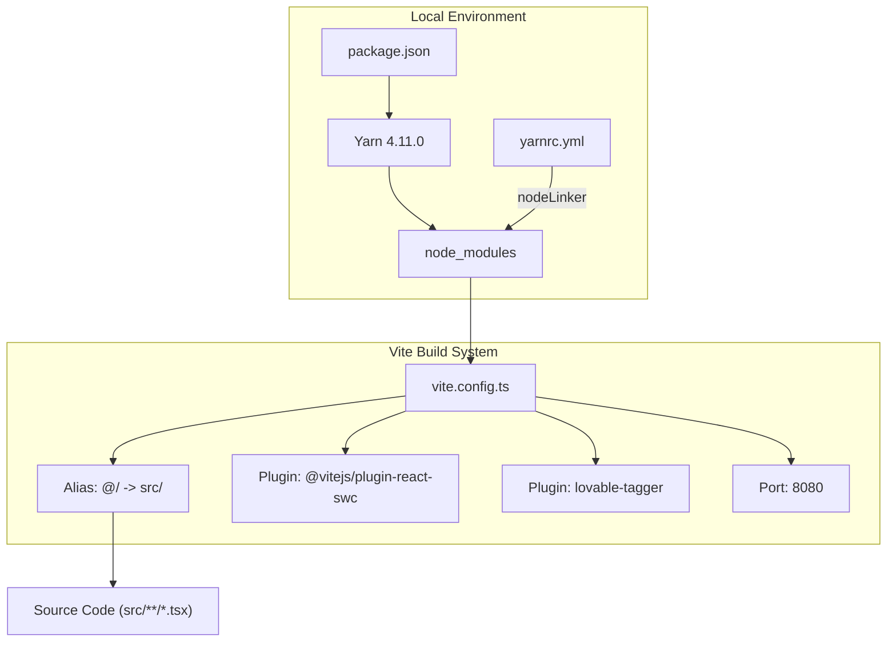

## 3. Environment Configuration

The application requires connection strings for Supabase (Database/Auth) and Google Apps Script (Consultation Form).

1. **Create Environment File**:
   Copy the example file to `.env`:
   ```bash
   cp .env.example .env
   ```

2. **Configure Variables**:
   Open `.env` and fill in the following values:

| Variable | Description | Source |
| :--- | :--- | :--- |
| `VITE_SUPABASE_URL` | The API URL for your Supabase project. | Supabase Dashboard > Settings > API |
| `VITE_SUPABASE_ANON_KEY` | The anonymous public key for client-side requests. | Supabase Dashboard > Settings > API |
| `VITE_APPS_SCRIPT_ENDPOINT` | The Web App URL for the consultation form script. | Google Apps Script > Deploy > Web App |


## 4. External Service Integration

The frontend interacts with two primary external systems. The data flow for these integrations is defined below, mapping UI components to their backend counterparts.

"External Service Integration Map"
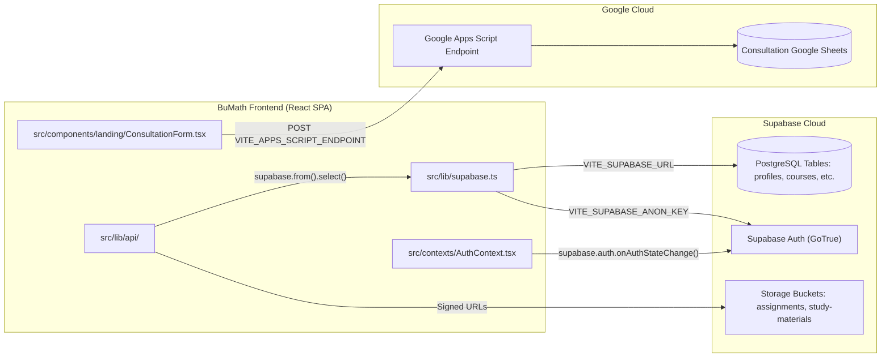

## 5. Running the Application

### Development Server
Start the Vite development server with Hot Module Replacement (HMR):
```bash
yarn dev
```
The application will be available at `http://localhost:8080`.,

### Production Build
To create a production-ready bundle in the `dist/` directory:
```bash
yarn build
```
To preview the production build locally:
```bash
yarn preview
```

## 6. Testing Configuration

The project uses **Vitest** and **React Testing Library** with a `jsdom` environment.,

### Running Tests
- **Run all tests**: `yarn test`
- **Watch mode**: `yarn test:watch`
- **Single file**: `yarn test src/path/to/file.test.ts`


## 7. Adding UI Components

The project strictly follows the **shadcn/ui** pattern. Do not manually create components that exist in the shadcn library. Check `src/components/ui/` first.,

To add a new component:
```bash
yarn dlx shadcn@latest add <component-name>
```
To install all available components (recommended for full environment parity):
```bash
yarn dlx shadcn@latest add --all
```

## 8. Summary of Commands

| Command | Action |
| :--- | :--- |
| `yarn dev` | Starts development server at port 8080 |
| `yarn build` | Generates production build in `/dist` |
| `yarn lint` | Runs ESLint for code quality checks |
| `yarn test` | Executes the Vitest suite |
| `yarn test:watch` | Runs Vitest in watch mode |
| `yarn dlx shadcn@latest add` | Installs a new UI primitive to `src/components/ui/` |


---

# Technology Stack

This page provides a detailed technical reference for the libraries, frameworks, and tools that comprise the BuMath LMS. The architecture is a modern React Single Page Application (SPA) powered by a Supabase backend-as-a-service, emphasizing type safety, responsive design, and efficient server-state management.

## Core Framework & Build Tooling

The application is built using **React 18** and **TypeScript**, leveraging the **Vite** build tool for rapid development and optimized production bundles.

*   **React 18.3.1**: Utilizes concurrent rendering features and the latest hook patterns,.
*   **Vite 5.4.19**: Serves as the development server and bundler, configured with path aliases (`@/` for `src/`),.
*   **TypeScript 5.8.3**: Enforces static typing across the codebase.
*   **Yarn 4.11.0**: The project uses Yarn Berry with the `node-modules` linker for dependency management,.

### Build & Dev Pipeline Diagram

This diagram illustrates how the build tools transform source code into the final SPA.

"Build Pipeline"
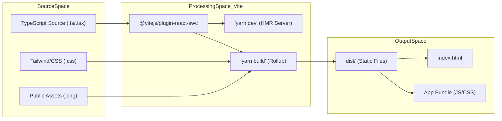

## Backend & Infrastructure: Supabase

BuMath utilizes **Supabase** for its entire backend infrastructure, including authentication, database, real-time communication, and file storage.

*   **Supabase Client (@supabase/supabase-js 2.78.0)**: A singleton client instance is used to interact with all Supabase services,.
*   **PostgreSQL**: The core relational database. Schema management is handled via SQL migrations [7.2. Supabase Migrations]().
*   **Supabase Realtime**: Powers the in-lesson chat system using `supabase.channel()` to listen for `postgres_changes` on the `lesson_chat_messages` table.
*   **Supabase Auth**: Manages user sessions and role-based access control (RBAC).
*   **Supabase Storage**:
    *   `assignments` bucket: Stores teacher-uploaded lesson materials.
    *   `submissions` bucket: Stores student-uploaded work.
    *   `standalone` bucket: Stores PDF study materials for the `/tai-lieu` library.

### Data Flow & Integration Diagram

This diagram bridges the frontend "API Layer" to the backend "Supabase Entities".

"System Integration Map"
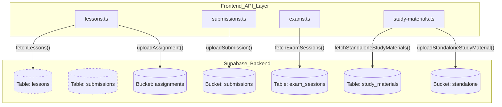

## UI & Design System

The visual identity follows a "Claymorphism" and "Glassmorphism" design language, implemented using Tailwind CSS and accessible component primitives.

*   **Tailwind CSS 3.4.17**: The primary styling engine, using utility classes and a custom HSL color palette,.
*   **shadcn/ui**: A collection of re-usable components built on top of **Radix UI** primitives (e.g., Dialog, Select, Accordion, Tabs).
*   **Framer Motion 12.34.3**: Powers complex animations and layout transitions, especially on the Landing Page.
*   **KaTeX 0.16.45**: High-performance LaTeX math rendering for the Mock Exam system and Lesson Content,.
*   **Lucide React**: The standard icon library.

## Specialized Utilities

| Library | Purpose | Implementation Detail |
| :--- | :--- | :--- |
| **TanStack Query v5** | Server State Management | Manages fetching, caching, and optimistic updates for lessons and chat. |
| **React Router v6** | Client-side Routing | Handles navigation and protected routes. |
| **dnd-kit** | Drag-and-Drop | Enables reordering of chapters, lessons, and exam questions. |
| **browser-image-compression** | Image Optimization | Compresses student submissions to reduce storage costs and upload time. |
| **heic2any** | Format Conversion | Converts Apple HEIC images to JPEG for cross-platform compatibility. |
| **Recharts** | Data Visualization | Renders performance analytics for mock exam attempts. |
| **React Hook Form** | Form Management | Handles complex validation logic for admin forms using **Zod**,. |

## Testing Stack

The project employs a comprehensive testing suite for both unit and integration tests.

*   **Vitest 3.2.4**: A Vite-native testing framework used for fast execution.
*   **React Testing Library**: Used for component and hook testing.
*   **jsdom**: Provides a browser-like environment for tests.


---

# Project Roadmap & Development Phases

The BuMath LMS development is structured into three major milestones: the **v1.0 MVP**, which established the core functional learning platform; the **v2.0 UI Refactor**, which modernized the design language; and the **v3.0 Platform Expansion**, which transforms the system into a full educational ecosystem with pricing packages, mock exams, and real-time interaction.

## 1. Project Milestones

The roadmap tracks the transition from a functional prototype to a feature-rich AI EdTech SaaS platform.

| Milestone | Status | Focus | Key Deliverables |
|:---|:---|:---|:---|
| **v1.0 MVP** | ✅ Shipped | Core Functionality | Auth, Course CRUD, Student Submissions, Grading Queue. |
| **v2.0 UI Refactor** | ✅ Shipped | UX & Design | Claymorphism, Vietnamese URLs, Pagination, DnD Reordering. |
| **v3.0 Expansion** | 🔄 Active | Ecosystem | Package Model, Mock Exams, In-Lesson Chat, Public Materials. |


## 2. Development Phases (1–21)

The project is executed in 21 distinct phases, moving from infrastructure to advanced features.

### Phase 1–8: The Foundation (v1.0)
*   **Foundation & Auth:** Established the Vite + Supabase stack and role-based access control (RBAC) [,].
*   **Learning Loop:** Implemented Course/Chapter/Lesson management and student submission workflows [].
*   **Teacher Role:** Introduced explicit `teacher` access for grading and notifications [,].

### Phase 9–13: The Refactor (v2.0)
*   **URL & UI:** Migrated to Vietnamese URL aliases and implemented the **Claymorphism** design system [,].
*   **Admin UX:** Added server-side pagination and `dnd-kit` for content reordering [,].

### Phase 14–21: Platform Expansion (v3.0)
*   **Phase 14 (Pricing):** Transitioned from manual enrollment to a **Package Model** (`user_packages`) with DB-enforced access via `has_grade_access()` [,].
*   **Phase 16 (Lesson Tabs):** Refactored `LessonContent.tsx` into a 3-tab layout: Bài giảng, Bài kiểm tra, and Thảo luận [].
*   **Phase 17 (In-Lesson Chat):** Real-time messaging using Supabase Realtime and `REPLICA IDENTITY FULL` for state reconciliation [].
*   **Phase 18 (Mock Exams):** Timed sessions with KaTeX support and server-side `ends_at` enforcement [,].
*   **Phase 20 (UI/UX Redesign):** Ongoing system-wide redesign using the `/danh-muc` (catalogue) model as a baseline for a minimal, "white-first" aesthetic [].
*   **Phase 21 (Tài liệu):** Public study material browser at `/tai-lieu` with grade-filtered PDF downloads [].


## 3. Implementation Workflow

Implementation bridges high-level requirements to low-level code entities using a systematic mapping of API functions and UI components.

### Data Flow: Requirement to Code Entity
This diagram shows how a requirement (e.g., "In-lesson Chat") is realized across the stack.

**Feature Implementation Mapping**
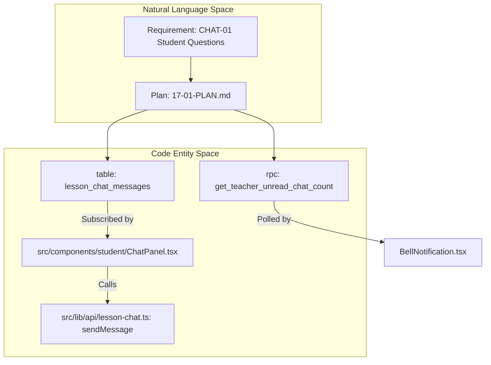

### Development Lifecycle
BuMath uses a "Wave" testing strategy where API contracts and core logic are tested before UI integration.

**Phase Execution Lifecycle**
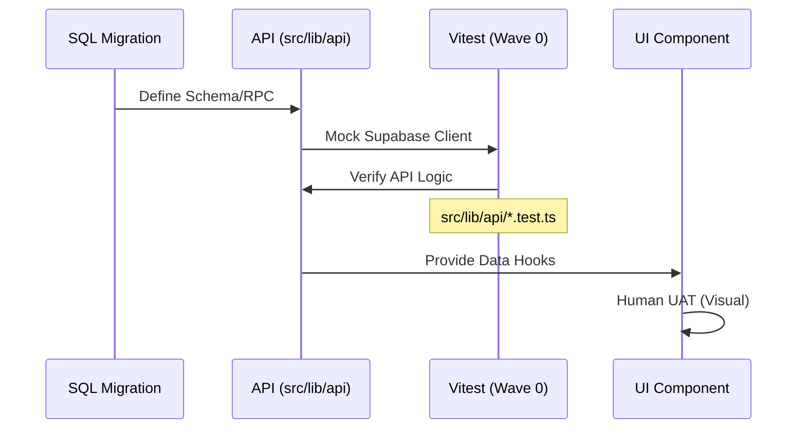

## 4. Current State & Metrics

The project is currently in **Phase 20 (Redesign)** with **Phase 21 (Tài liệu)** foundation completed.

### Progress Summary
*   **Total Plans Completed:** 35/36 [].
*   **Milestone Status:** v3.0 Platform Expansion is ~95% complete.
*   **Key Active Plan:** Phase 20 P05 — System-wide UI overhaul to a minimal aesthetic [].

### Technical Progress Metrics
| Category | Metric | Source |
|:---|:---|:---|
| **Velocity** | ~7min per plan execution | |
| **Coverage** | 31/31 v3.0 Requirements Mapped | |
| **Stability** | `yarn build` exits 0 across all v3 phases | |

### Recent Critical Decisions
| Decision | Rationale | File Reference |
|:---|:---|:---|
| **Soft-Delete RPC** | Prevents data loss; strictly controlled via `SECURITY DEFINER`. | `lesson_chat.sql` [ |
| **Standalone Materials** | Set `lesson_id` to nullable to allow site-wide PDF library. | `21-CONTEXT.md` [ |
| **Merged Notifications** | Merges graded assignments and unread chat into one bell badge. | `BellNotification.tsx` [ |


---

# Core Architecture

The BuMath LMS is built as a modern Single-Page Application (SPA) utilizing a decoupled architecture. The frontend is a React application powered by Vite, while the backend is entirely managed by Supabase, providing Database (PostgreSQL), Authentication, and File Storage.

The system is designed with a clear separation between the presentation layer, the API orchestration layer, and the persistence layer, using Role-Based Access Control (RBAC) to manage student and administrative workflows.

## System Overview Diagram

The following diagram illustrates the high-level flow from the user's browser through the application shell and authentication gate to the Supabase backend.

### High-Level Data Flow
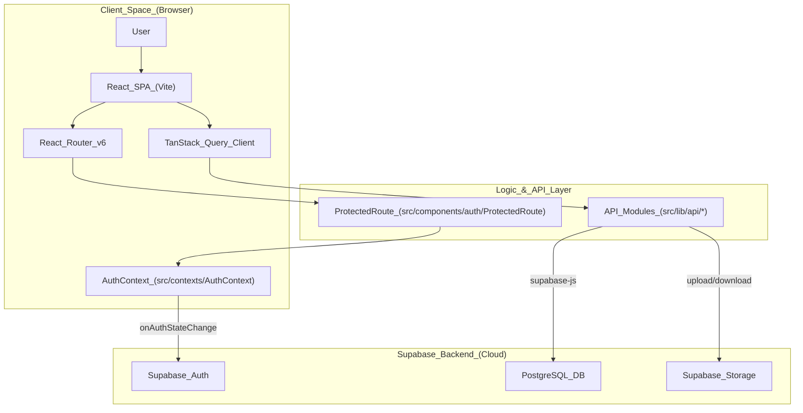
**Sources:**,,.

---

## Architectural Layers

### 1. Presentation Layer (React SPA)
The frontend is organized into reusable UI primitives (shadcn/ui) and domain-specific components. It uses a "Claymorphism" design system for students and "Glassmorphism" for administrative and exam interfaces.
*   **Design Tokens:** Managed via CSS variables in `src/index.css` and extended in `tailwind.config.ts`.
*   **Visual Identity:** Includes custom animations like `bm-float` for decorative math symbols and a chalkboard background `bm-chalk-bg`.
*   **State Management:** Local component state for UI toggles, TanStack Query for server-state caching, and React Context for global authentication.

For details, see [Design System & UI](#3).

**Sources:**,.

### 2. Routing & Provider Hierarchy
The application is wrapped in a series of providers that establish the execution context. The hierarchy ensures that authentication and data-fetching capabilities are available to all routes.
*   **Provider Order:** `QueryClientProvider` → `TooltipProvider` → `Toaster` → `BrowserRouter` → `AuthProvider`.
*   **Route Structure:** Defines public routes (Landing, Login, Register) and protected segments for students and admins using Vietnamese URL aliases like `/dang-nhap` and `/quan-tri/khoa-hoc`.

For details, see [Routing & Application Shell](#2.1).

**Sources:**.

### 3. Authentication & Access Control
Authentication is handled by Supabase Auth and synchronized via the `AuthContext`.
*   **RBAC:** The `ProtectedRoute` component inspects the user's `profile.role` (`student`, `teacher`, or `admin`).
*   **Role Redirects:** Users are automatically redirected to their primary dashboard: students to `/khoa-hoc`, teachers to `/quan-tri/bai-nop`, and admins to `/quan-tri/nguoi-dung`,.

For details, see [Authentication & Access Control](#2.2).

**Sources:**,,.

### 4. API Layer & Data Flow
The application communicates directly with Supabase via specialized API modules in `src/lib/api`.
*   **Orchestration:** Modules like `study-materials.ts` handle complex flows such as fetching standalone materials vs. lesson-linked materials.
*   **Security:** Data integrity is enforced at the database level via Row Level Security (RLS). For example, public users can only see published courses.

For details, see [API Layer (src/lib/api)](#2.4).

**Sources:**,.

---

## Code Entity Mapping

This diagram bridges conceptual system names to the specific code entities and files implementing them.

### Logic to Code Mapping
```mermaid
classDiagram
    class "ApplicationShell" {
        App.tsx
        main.tsx
        BrowserRouter
    }
    class "AuthSystem" {
        AuthContext.tsx
        ProtectedRoute.tsx
        phoneToEmail()
    }
    class "APILayer" {
        courses.ts
        study-materials.ts
        exams.ts
        submissions.ts
    }
    class "Layouts" {
        StudentLayout.tsx
        AdminLayout.tsx
    }

    ApplicationShell --|> AuthSystem : "initializes"
    ApplicationShell --|> Layouts : "composes"
    AuthSystem --|> APILayer : "provides_user_context"
    APILayer ..> "SupabaseClient" : "uses"
```
**Sources:**,,,.

---

## Key Subsystems

| Subsystem | Responsibility | Key Files |
| :--- | :--- | :--- |
| **Routing** | URL mapping and layout nesting | `src/App.tsx` |
| **Auth** | Session management and RBAC | `src/contexts/AuthContext.tsx`, `src/components/auth/ProtectedRoute.tsx` |
| **Database** | Persistence and RLS security | `supabase/migrations/` |
| **API** | Data orchestration and Supabase queries | `src/lib/api/*.ts` |
| **UI System** | Theming, Claymorphism, and Glassmorphism | `src/index.css`, `src/components/ui/` |

---

## Child Pages

*   **[Routing & Application Shell](#2.1)** — Detailed provider hierarchy, route definitions, and layout nesting (StudentLayout/AdminLayout).
*   **[Authentication & Access Control](#2.2)** — Deep dive into `AuthContext`, phone-to-email mapping, and RBAC redirect logic.
*   **[Database Schema & Supabase Integration](#2.3)** — Reference for PostgreSQL tables (profiles, courses, exam_sessions) and RLS security policies.
*   **[API Layer (src/lib/api)](#2.4)** — Documentation for the frontend-to-Supabase communication modules and signed URL handling.

---

# Routing & Application Shell

The BuMath application shell is the foundational structure that orchestrates the user experience by wiring together authentication states, data fetching providers, and role-based navigation. It utilizes **React Router v6** for navigation and a nested layout architecture to differentiate between student and administrative contexts.

## Provider Hierarchy

The application is wrapped in a specific hierarchy of providers in `App.tsx` to ensure that global states (auth, data, UI) are available to all routes.

1.  **QueryClientProvider**: Manages server state and caching via TanStack Query.
2.  **TooltipProvider**: Provides accessible tooltip functionality from Radix UI.
3.  **Toaster / Sonner**: Global toast notification components for feedback.
4.  **BrowserRouter**: Handles URL synchronization. It uses a `basename` derived from `import.meta.env.BASE_URL` to support hosting in subdirectories (e.g., GitHub Pages).
5.  **AuthProvider**: The custom context that tracks Supabase authentication and user profile data.

### Data Flow and Context Initialization

Title: Application Provider Hierarchy
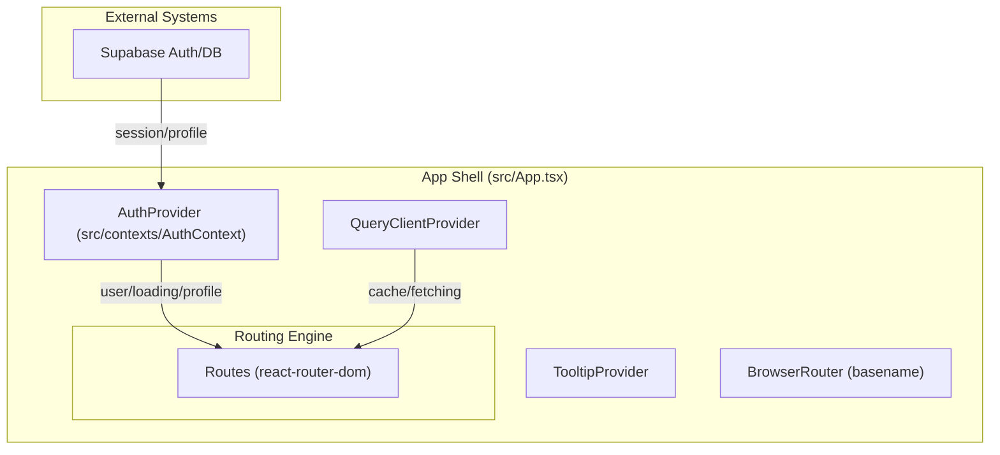

---

## Routing Configuration & Vietnamese Aliases

The application uses localized Vietnamese URL aliases for better accessibility and SEO. Routes are defined in `src/App.tsx` and are categorized by their access requirements.

### Public & Informational Routes
-   `/`: Landing page (`Index`).
-   `/dang-nhap`: Login page.
-   `/dang-ky`: Registration page.
-   `/gioi-thieu`: About page.
-   `/huong-dan`: User manual/instructions.
-   `/thanh-toan`: Payment information.
-   `/tai-lieu`: Public standalone study materials library.
-   `/danh-muc`: Public course catalogue.

### Student Routes (Protected)
-   `/khoa-hoc`: My Courses list.
-   `/khoa-hoc/:courseSlug`: Specific course detail and lesson player.
-   `/de-thi`: Mock exams listing.
-   `/de-thi/:sessionId`: Active exam attempt interface.
-   `/ho-so`: User profile and active packages.

### Administrative Routes (RBAC Protected)
-   `/quan-tri/nguoi-dung`: User management (Admin only).
-   `/quan-tri/khoa-hoc`: Course management (Admin only).
-   `/quan-tri/goi-hoc`: Learning packages management (Admin only).
-   `/quan-tri/bai-nop`: Submission grading queue (Admin/Teacher).
-   `/quan-tri/de-thi`: Mock exam authoring (Admin/Teacher).
-   `/quan-tri/tai-lieu`: Standalone materials management (Admin/Teacher).

| Path Alias | Code Entity | Role Requirement |
| :--- | :--- | :--- |
| `/dang-nhap` | `Login.tsx` | Public |
| `/tai-lieu` | `TaiLieuPage.tsx` | Public |
| `/de-thi` | `MockExamsPage.tsx` | `student` |
| `/quan-tri/bai-nop` | `SubmissionsPage.tsx` | `admin`, `teacher` |
| `/quan-tri/tai-lieu` | `TaiLieuAdminPage.tsx` | `admin`, `teacher` |


---

## Layout Nesting Strategy

BuMath employs a recursive layout strategy to provide consistent navigation while separating student and admin concerns.

### StudentLayout
The `StudentLayout` provides the top-level navigation bar (80px height), the site logo, and the `BellNotification` system. It applies the `.app-student` CSS scope and handles the logout logic,.

### AdminLayout
The `AdminLayout` provides a side navigation bar (sidebar) for administrative tasks. It is nested *inside* the `StudentLayout` for admin routes to maintain top-level branding. It supports a `fullBleed` mode which hides the sidebar for immersive editing (e.g., `StudentCourseDetailPage` in admin mode).

Title: Nested Layout Structure for Admin Routes
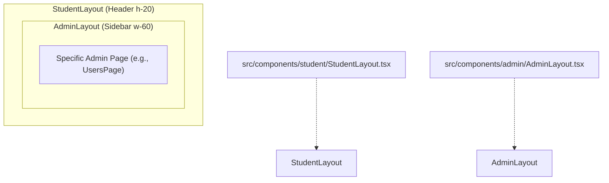

---

## Role-Based Access Control (ProtectedRoute)

The `ProtectedRoute` component is the gatekeeper for authenticated routes. It handles three primary states:

1.  **Loading**: Displays a spinner while `AuthProvider` resolves the session.
2.  **Unauthenticated**: Redirects to `/dang-nhap`.
3.  **Unauthorized Role**: 
    -   If `allowedRoles` is provided and the user's role is not included, it uses `redirectFor` to send the user to their appropriate dashboard (e.g., teachers to `/quan-tri/bai-nop`, students to `/khoa-hoc`),.
    -   Admin-specific routes use `requiredRole="admin"` to strictly limit access.

### Automatic Redirection on Login
The `Login` and `Register` pages include logic to automatically redirect users if they are already authenticated or upon successful entry, based on their `profile.role`,.


---

## The NotFound Page

The `NotFound` page (`/pages/NotFound.tsx`) serves as the catch-all for invalid URLs. It is role-aware:
-   If a student hits a 404, the "Back to Home" link points to `/khoa-hoc`.
-   Otherwise, it points to the public landing page `/`.
-   It logs the error to the console with the attempted path for debugging purposes.


---

# Authentication & Access Control

This page provides a technical deep dive into the BuMath authentication system and role-based access control (RBAC) mechanisms. The system is built on Supabase Auth but utilizes a custom "phone-to-email" mapping to simplify the user experience while maintaining security.

## System Architecture

The authentication flow integrates React Context for state management, Supabase for identity and session persistence, and a custom `ProtectedRoute` component for route-level authorization.

### Data Flow Diagram: Authentication & Authorization

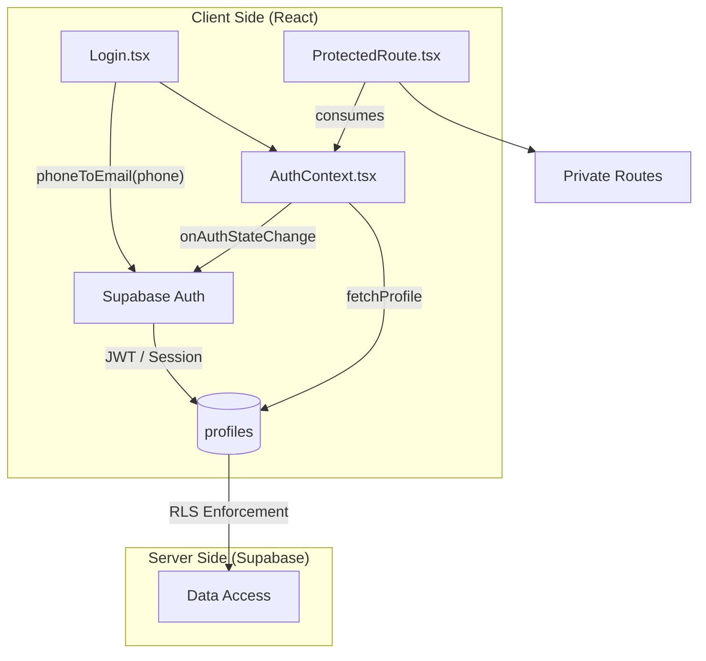

**Sources:**,,

---

## Phone-to-Email Mapping

To avoid the complexities and costs of SMS providers while providing a phone-number-based login experience, BuMath implements a transparent mapping strategy.

- **D-01 Decision:** The system uses a dummy email domain (`@bumath.local`) to satisfy Supabase's email requirement [ .planning/phases/02-auth-access-control/02-CONTEXT.md:24-24]().
- **Implementation:** The login identifier is visually a phone number, but it is converted to an email format under-the-hood [ .planning/phases/02-auth-access-control/02-CONTEXT.md:14-17]().
- **Validation:** Phone numbers are normalized to E.164 format (e.g., +84...) to ensure consistency across the database and auth provider.

**Sources:** [ .planning/phases/02-auth-access-control/02-CONTEXT.md:24-24](),

---

## AuthContext & Session Management

The `AuthContext` (provided via `AuthProvider` in `App.tsx`) is the central source of truth for the user's identity, session, and profile data.

### Key Responsibilities
1.  **Session Tracking:** Listens to `supabase.auth.onAuthStateChange` to update the `user` and `session` state.
2.  **Profile Enrichment:** When a user is authenticated, it fetches the corresponding record from the `profiles` table to determine the user's `role`.
3.  **Loading State:** Manages a `loading` flag to prevent flickering or premature redirects during initial session hydration. While `loading` is true, `ProtectedRoute` renders a spinner.

**Sources:**,

---

## Role-Based Access Control (RBAC)

RBAC is enforced at the Routing layer (React Router) and the Database layer (PostgreSQL RLS).

### Route Protection (`ProtectedRoute`)

The `ProtectedRoute` component wraps sensitive routes in `App.tsx` and validates the user's role against required permissions.

| Prop | Type | Description |
| :--- | :--- | :--- |
| `requiredRole` | `Role` | Legacy API for single-role requirement (redirects to `/` on failure). |
| `allowedRoles` | `Role[]` | Modern API allowing multiple roles (redirects to role-aware fallback). |

#### Role-Based Redirects
Upon login or unauthorized access, the system performs role-aware redirection:
- **Admin:** Redirected to `/quan-tri/nguoi-dung`.
- **Teacher:** Redirected to `/quan-tri/bai-nop`,.
- **Student:** Redirected to `/khoa-hoc`,.

**Sources:**,,

### Database Protection (RLS)

Row Level Security (RLS) ensures data isolation even if UI checks are bypassed. The system uses a `get_my_role()` helper function defined with `SECURITY DEFINER` to check permissions without recursion.

| Policy Name | Table | Rule |
| :--- | :--- | :--- |
| `Students can view own profile` | `profiles` | `id = auth.uid() OR get_my_role() IN ('admin', 'teacher')` |
| `Admin can update any profile` | `profiles` | `get_my_role() = 'admin'` |
| `public_read_courses` | `courses` | `is_published = true` (for `anon` users) |

**Sources:**,

---

## Code Entity Mapping

This diagram maps natural language concepts to specific code entities within the authentication subsystem.

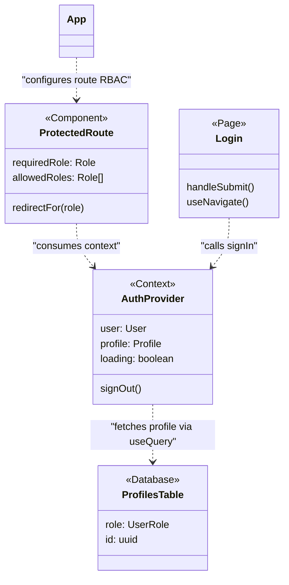

**Sources:**,,,

---

## Access Control in Layouts

Role-based visibility is also enforced within layout components. For example, `AdminLayout` filters navigation items based on the user's role:
- **Admin:** Sees "Quản lý tài khoản" and "Quản lý khóa học".
- **Teacher:** Only sees "Chấm bài".

**Sources:**

---

# Database Schema & Supabase Integration

This page provides a technical reference for the BuMath PostgreSQL schema, hosted on Supabase. The system utilizes a "Backend-as-a-Service" (BaaS) pattern where business logic is primarily enforced through **Row Level Security (RLS)** policies, **PostgreSQL Triggers**, and **Security Definer** functions.

## Entity Relationship Diagram

The following diagram illustrates the core data entities and their relationships within the `public` schema, including the learning package system and mock exam infrastructure.

**BuMath Core Schema**
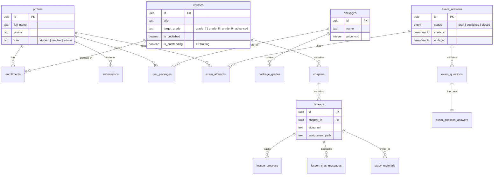
**Sources:**,,,,

---

## Core Database Tables

### Learning Management & Content
| Table | Purpose | Key Constraints |
| :--- | :--- | :--- |
| `profiles` | Extended user data linked to `auth.users`. | `id` (FK auth.users) |
| `courses` | Educational containers with `target_grade` and `is_outstanding` (Tứ trụ) flags. | `target_grade` enum |
| `lessons` | Units containing YouTube URLs and assignment paths. | `chapter_id` (FK) |
| `lesson_chat_messages` | Real-time discussion per lesson with soft-delete support. | `REPLICA IDENTITY FULL` |
| `study_materials` | PDF resources. `lesson_id` is NULL for standalone materials. | `grade` check |

### Access & Entitlements (Package Model)
| Table | Purpose | Logic |
| :--- | :--- | :--- |
| `packages` | Commercial offerings (e.g., "Lớp 9", "Tứ trụ"). | Price and metadata |
| `package_grades` | Maps a package to one or more grades. | Junction table |
| `user_packages` | Student ownership of a package. | Triggers auto-enrollment |

### Mock Exam System
| Table | Purpose | Logic |
| :--- | :--- | :--- |
| `exam_sessions` | Timed exam windows (monthly/quarterly). | `starts_at` / `ends_at` |
| `exam_questions` | Question prompts with LaTeX and 4 options. | `order_index` unique per session |
| `exam_attempts` | Student answers and auto-calculated scores. | `answers_payload` jsonb |

---

## Access Control & Security Barrier

The system uses a Security Barrier View (`lessons_view`) to prevent students from accessing video URLs for courses they haven't paid for, even if they bypass the UI.

**Data Flow: Video URL Masking**
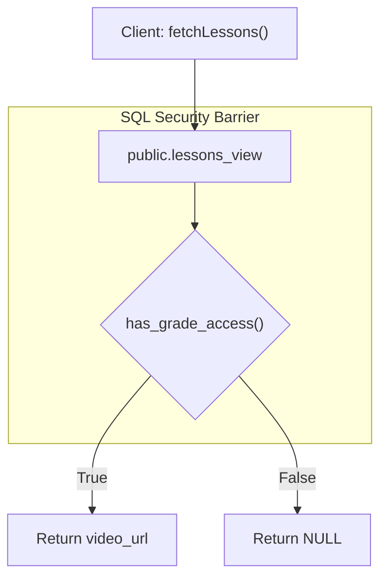
**Sources:**

### Key Security Functions
*   `get_my_role()`: Retrieves the caller's role from `profiles` via `SECURITY DEFINER` to avoid RLS recursion.
*   `has_grade_access(p_grade)`: Checks if the user owns a package covering the specific grade.
*   `delete_chat_message(p_message_id)`: RPC for teachers to soft-delete messages by setting `deleted_at`.

---

## Triggers & Automation

### 1. Enrollment Management
The system automates student access when an admin assigns a package.
*   **Insert Trigger (`trg_add_enrollments_for_package`)**: When a `user_packages` record is created, the student is automatically enrolled in all published courses matching the package's grades.
*   **Delete Trigger (`trg_remove_enrollments_for_package`)**: When a package is revoked, enrollments are removed *unless* the student owns another package that also covers that grade.

### 2. Profile Synchronization
*   **Function:** `handle_new_user()`
*   **Trigger:** `on_auth_user_created` on `auth.users`.
*   **Behavior:** Maps `full_name`, `phone`, `year_of_birth`, and `address` from `raw_user_meta_data` to the `public.profiles` table.

### 3. Exam Integrity
*   **Trigger:** `trg_guard_exam_questions_mutation`
*   **Logic:** Prevents any updates or deletions to questions or answers once the first student has started an `exam_attempt` for that session.

---

## Storage Buckets & Policies

| Bucket | Path Pattern | Access Rule |
| :--- | :--- | :--- |
| `assignments` | `submissions/{user_id}/*` | Students can upload; Teachers/Admins can read. |
| `study-materials` | `standalone/*` or `lessons/*` | Public read for standalone (`lesson_id` IS NULL); Teacher/Admin upload. |
| `exam-images` | `sessions/{session_id}/*` | Admin/Teacher managed; Students read during active exam window. |

---

## Migration History Summary (v3.0)

The schema is managed via 40+ sequential migrations. Key milestones include:
*   **Migrations 01-05:** Profiles, Course/Chapter/Lesson foundation, and basic Storage.
*   **Migration 17:** Removal of `approval_status` to streamline onboarding.
*   **Migrations 18-20:** Implementation of the Package Entitlement System and the `lessons_view` security barrier.
*   **Migration 21:** In-lesson chat with Realtime support and soft-delete.
*   **Migration 22:** Mock Exam System foundation.
*   **Migration 28:** Public standalone study materials and anonymous storage access.

**Sources:**,,

---

# API Layer (src/lib/api)

The API layer serves as the intermediary between the React frontend and the Supabase backend. It encapsulates all data fetching, mutation logic, and complex business operations like image compression, unique slug generation, and batch reordering.

## Overview of API Modules

The `src/lib/api` directory is organized into specialized modules, each corresponding to a core entity in the BuMath ecosystem. These modules use the Supabase JS client `supabase` [src/lib/supabase.ts]() to interact with the PostgreSQL database.

### Core Architecture Pattern

Most modules follow a standard pattern for data operations:
1.  **CRUD Operations**: Direct wrappers around Supabase `.from().select()`, `.insert()`, `.update()`, and `.delete()`.
2.  **Pagination & Filtering**: Server-side logic using `.range()`, `.ilike()`, and `.eq()` to optimize performance.
3.  **Unique Identifiers**: Automated generation of URL-friendly slugs for SEO and Vietnamese accessibility.
4.  **Security Barrier**: Use of the `lessons_view` for student-facing queries to enforce package-based access control.

### API Layer Data Flow

The following diagram illustrates how the API layer mediates between UI components and the Supabase backend.

**Data Flow: UI to Database**
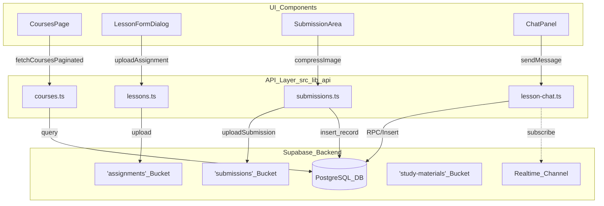

---

## Course & Content Management

### Courses API (`courses.ts`)
Handles course lifecycle management, including target grade filtering and visibility toggling.

*   **`fetchCoursesPaginated(params)`**: Implements server-side search and filtering by `target_grade`. It uses `.range(from, to)` for efficient data retrieval.
*   **`generateUniqueCourseSlug(base, excludeId)`**: Ensures that generated slugs (e.g., `toan-lop-7-nang-cao`) do not conflict. If a conflict is found, it appends a numeric suffix (e.g., `-2`).
*   **`publishCourse(id, isPublished)`**: Admin-only function to toggle the `is_published` flag, which controls visibility in the student catalogue.

### Chapters API (`chapters.ts`)
Manages the organizational hierarchy within courses.

*   **`batchReorderChapters(updates)`**: Accepts an array of `{ id, order_index }` and issues sequential updates to persist the order defined in the admin drag-and-drop UI.

### Lessons API (`lessons.ts`)
Manages individual lessons, YouTube video URLs, and assignment files.

*   **`fetchLessonsForStudent(chapterId)`**: Queries the `lessons_view` instead of the raw `lessons` table. This view automatically masks `video_url` to `NULL` if the student lacks the required learning package.
*   **`uploadAssignment(file, pathPrefix)`**: Uploads files to the `assignments` bucket. It sanitizes filenames and appends a random 4-character suffix to prevent collisions.
*   **`parseAssignmentPaths(path)`**: A utility that handles both legacy single-string paths and modern JSON-encoded arrays for multi-file assignments.


---

## Student Progress, Submissions & Chat

### Submissions API (`submissions.ts`)
Handles the complex workflow of student homework, including image processing and secure storage.

*   **`compressImage(file)`**: Uses `browser-image-compression` to reduce images to <500KB. It includes a fallback for iOS HEIC files using `heic2any`.
*   **`uploadSubmission(userId, lessonId, compressedFiles)`**: Uploads multiple images to the private `submissions` bucket and creates a record in the database. Paths are stored as a JSON array in the `file_path` column.
*   **`getSubmissionSignedUrls(filePath)`**: Generates temporary (TTL: 1 hour) signed URLs for private images so they can be viewed in the browser without public bucket access.

**Submission Lifecycle & Code Entities**
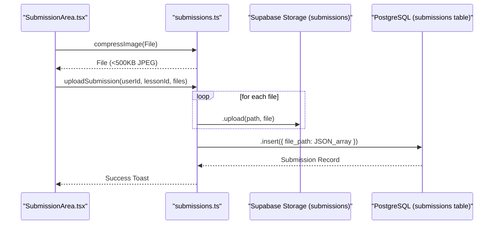

### Lesson Chat API (`lesson-chat.ts`)
Enables real-time discussion within lessons.

*   **`sendMessage({ lessonId, content, parentId })`**: Inserts a new message. If `parentId` is provided, the message is treated as a reply.
*   **`markChatRead(lessonId)`**: A security-definer RPC that allows teachers to clear unread badges for a specific lesson.
*   **Realtime Integration**: UI components subscribe to the `lesson-chat` channel for the current `lessonId` to receive instant updates.

### Study Materials API (`study-materials.ts`)
Manages both lesson-linked and standalone PDF/Image resources.

*   **`fetchStudyMaterials(lessonId)`**: Retrieves materials attached to a specific lesson.
*   **`fetchStandaloneStudyMaterials(grade)`**: Retrieves materials where `lesson_id` is `NULL`, used for the global "/tai-lieu" page.
*   **`uploadStandaloneStudyMaterial`**: Handles dual-file uploads (PDF + Thumbnail) to the `standalone/` path in storage.

---

## Packages & Access Control

### Packages & User-Packages API
Manages the entitlement system that controls course access.

*   **`fetchPackagesPaginated(params)`**: Admin utility to list and search available learning packages.
*   **`deletePackage(id)`**: Removes a package definition; restricted to admins.
*   **Access Logic**: While the API layer fetches data, access is primarily enforced via the `has_grade_access(grade)` PostgreSQL function, which is utilized by RLS and the `lessons_view`.

---

## Table of API Function Signatures

| Module | Key Function | Purpose | Implementation Detail |
| :--- | :--- | :--- | :--- |
| `courses.ts` | `fetchCoursesPaginated` | Admin list view | Uses `.ilike` for search |
| `lessons.ts` | `fetchLessonsForStudent` | Student content | Queries `lessons_view` |
| `submissions.ts` | `compressImage` | Client-side optimization | Target size < 512KB |
| `submissions.ts` | `getSubmissionSignedUrls` | Security | Private bucket access |
| `study-materials.ts` | `uploadStudyMaterial` | Content Authoring | Path: `{lessonId}/{timestamp}.ext` |
| `packages.ts` | `fetchPackagesPaginated` | Pricing Management | Server-side pagination |


---

# Design System & UI

The BuMath Design System provides a cohesive visual identity that distinguishes between student and administrative experiences. While the platform initially launched with a playful "Claymorphism" aesthetic, it has evolved into a sophisticated "AI EdTech SaaS" design language. This system uses **Tailwind CSS**, **shadcn/ui**, and **Framer Motion** to deliver a responsive, interactive experience across all user roles.

### System Overview

The UI is structured into three primary layers:
1.  **Global Tokens & Styles**: Base CSS variables, typography (Be Vietnam Pro), and core design utility classes.
2.  **Shared UI Library**: Atomic components provided by shadcn/ui and Radix UI primitives.
3.  **Application Contexts**: Scoped design languages for students (Indigo/Glassmorphism) and marketing (Orange/Claymorphism).

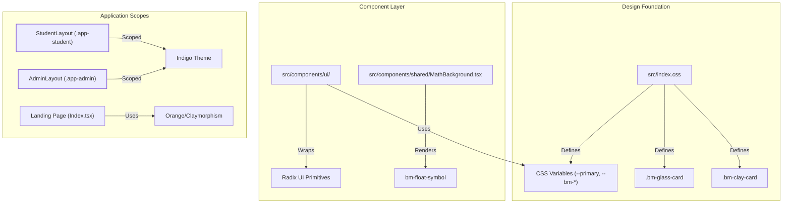

---

## BuMath Design Tokens & Design Languages

The platform utilizes two distinct design languages managed through Tailwind configuration and CSS custom properties:

*   **Glassmorphism (Student/Admin)**: The primary interface for authenticated users. It features semi-transparent surfaces (`bg-white/80`), backdrop blurs (`backdrop-blur-sm`), and an indigo-centric color palette (`#4F46E5`),.
*   **Claymorphism (Landing/Marketing)**: A playful, "toy-like" aesthetic used for the public landing page and authentication screens. It uses bold orange accents (`#F97316`), thick borders (`3px`), and double shadows via the `.bm-clay-card` utility,.
*   **Design Tokens**: Managed via `:root` variables in `src/index.css`. The `--primary` token resolves to Indigo for students and admins, while the landing page retains orange highlights.

For detailed token values and theme scoping, see **[BuMath Design Tokens & Claymorphism](#3.1)**.


---

## Landing Page Components

The public-facing landing page serves as the marketing engine. It uses a high-contrast layout with "brand-orange" highlights to drive conversions.

*   **Hero & Class Grid**: Interactive sections that categorize courses by grade level and "Tứ trụ" status.
*   **Floating Symbols**: The `MathBackground` component renders animated mathematical symbols (`π`, `θ`, `∑`) using the `bm-float` keyframes to create visual depth without distracting from content,.
*   **Responsive Navigation**: A sticky header that switches between public navigation and authenticated user redirects.

For documentation on marketing components and lead capture, see **[Landing Page Components](#3.2)**.


---

## Shared UI Components (shadcn/ui)

BuMath utilizes **shadcn/ui** for its core atomic components. These are located in `src/components/ui/` and provide a consistent functional baseline.

| Component Category | Key Entities | Role |
|:---|:---|:---|
| **Layout Shells** | `StudentLayout`, `AdminLayout` | Provide role-based navigation and consistent backgrounds. |
| **Overlays** | `Dialog`, `Select`, `Popover` | Built on Radix UI for accessible modal and dropdown workflows. |
| **Feedback** | `Progress`, `BellNotification` | Visual cues for learning progress and grading updates,. |
| **Decorative** | `MathBackground` | Shared background utility for auth and dashboard pages. |

The system uses the `cn()` utility to merge global styles with component-specific overrides, such as switching between `.bm-progress-teal` and `.bm-progress-indigo`.

For the full component inventory, see **[Shared UI Components (shadcn/ui)](#3.3)**.


---

## UI Architecture Diagram

This diagram illustrates the relationship between design tokens, layout wrappers, and the resulting design language applied to different application sectors.

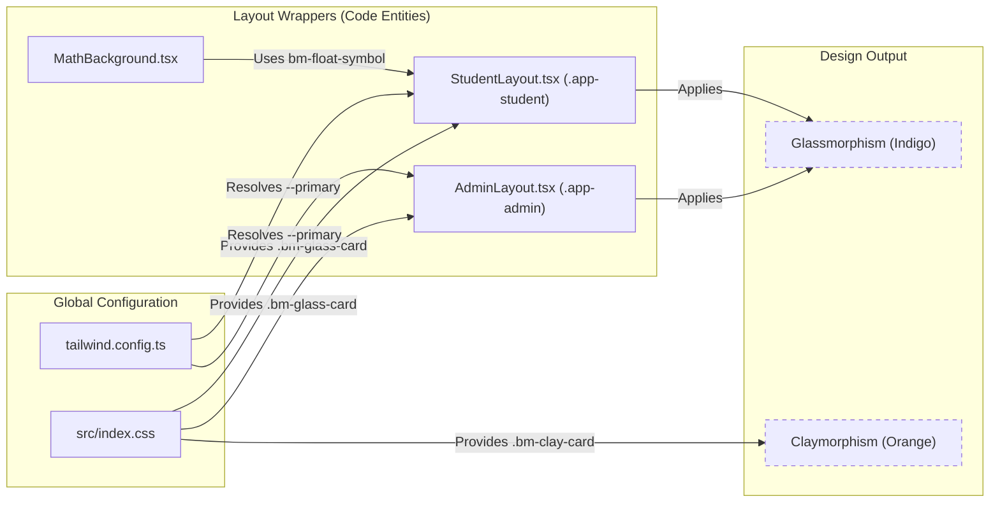

---

# BuMath Design Tokens & Claymorphism

This page provides a detailed technical reference for the BuMath design system, covering the transition from v2.0 **Claymorphism** to the v3.0 **AI EdTech SaaS** aesthetic introduced in Phase 20. The system employs a dual-language approach: high-energy Claymorphism for marketing/auth and a premium Indigo Glassmorphism for the student and admin application shells.

## Design Philosophy & Phase 20 Overhaul

The BuMath UI evolved through two major design paradigms:
1.  **Claymorphism (v2.0)**: Characterized by thick `3px` borders, hard-offset shadows, and a "bubbly" feel. It uses a warm orange (`#F97316`) and navy (`#1e3a5f`) palette.
2.  **Indigo Glassmorphism (v3.0)**: Introduced in Phase 20 to provide a modern "AI SaaS" look. It features semi-transparent surfaces, backdrop blurs, and an indigo (`#4F46E5`) primary color.

### Visual System Mapping

```mermaid
graph TD
    subgraph "Visual Style"
        Style1["'Claymorphism'"]
        Style2["'Glassmorphism'"]
        Style3["'Chalkboard'"]
    end

    subgraph "CSS Classes (src/index.css)"
        Style1 -->|Implemented by| C1[".bm-clay-card"]
        Style1 -->|Implemented by| C2[".bm-clay-card-student"]
        Style2 -->|Implemented by| G1[".bm-glass-card"]
        Style3 -->|Implemented by| B1[".bm-chalk-bg"]
    end

    subgraph "Application Context"
        C1 -->|Usage| Auth["Login / Register"]
        C2 -->|Legacy Usage| StuOld["Student V2"]
        G1 -->|Current Usage| StuNew["Student / Admin V3"]
        B1 -->|Usage| Landing["Landing Page Sections"]
    end
```


## Design Tokens (CSS Variables)

The system utilizes semantic CSS variables prefixed with `--bm-` and standard Tailwind HSL variables. Phase 20 shifted the primary brand color from orange to indigo for the application dashboard.

### Core Color Tokens

| Token | Value (HSL/Hex) | Role |
| :--- | :--- | :--- |
| `--primary` | `245 94% 58%` | Indigo-600 used for active states, focus rings, and primary buttons. |
| `--bm-primary` | `#4F46E5` | Static Indigo brand color. |
| `--bm-cta` | `#4F46E5` | Call-to-Action button background. |
| `--bm-border` | `#F97316` | (Legacy) Orange border for claymorphic components. |
| `--bm-card` | `#FFFFFF` | Background for standard cards. |

### Theme Scoping
The application uses CSS class scoping to apply theme-specific styles:
*   `.app-student`: Scopes the student dashboard experience.
*   `.app-admin`: Scopes the administrative and teacher portal.


## Key UI Components

### 1. Glassmorphism Card (`.bm-glass-card`)
The primary container for v3.0 student and admin pages.
*   **Implementation**: `background: rgba(255, 255, 255, 0.80)`, `backdrop-filter: blur(8px)`, and a `1px` white border.
*   **Interaction**: Lifts slightly on hover (`translateY(-4px)`) with an expanded shadow.

### 2. Claymorphic Card (`.bm-clay-card`)
Used in high-impact areas like Login and Registration.
*   **Implementation**: `3px` solid border and a hard-offset shadow: `box-shadow: 0 8px 0 var(--bm-border)`.
*   **Usage**: Wraps the login form in `Login.tsx`.

### 3. Math Background & Floating Symbols
Decorative elements that reinforce the educational context.
*   **`MathBackground`**: A shared component rendering a grid of math symbols.
*   **Animation**: `bm-float` keyframe moves symbols `-12px` vertically. Durations are randomized across 30+ nth-child selectors to create an organic, asynchronous floating effect.

### 4. Chalkboard Background (`.bm-chalk-bg`)
*   **Implementation**: Uses a deep navy hex `#1e3a5f` combined with a fractal noise SVG background to simulate texture.


## Typography & Fonts

BuMath uses a specific font stack defined in `index.html` and `index.css`:
*   **Be Vietnam Pro**: The primary UI font for all dashboards, tables, and forms.
*   **Baloo 2**: Used for display headings and hero sections.
*   **Comic Neue**: Reserved for playful or decorative accents.

### Font Weight Rules (Phase 20)
*   **400 (Regular)**: Body text, labels, and inactive navigation items.
*   **700 (Bold)**: Headings, card titles, and active navigation states.


## Implementation Data Flow

The following diagram illustrates how design tokens flow from CSS variables through Tailwind into the React components.

```mermaid
graph LR
    subgraph "Token Definition"
        CSS_VARS["src/index.css: :root { --primary, --bm-cta }"]
    end

    subgraph "Tailwind Config"
        TW_CFG["tailwind.config.ts: colors: { primary: 'hsl(var(--primary))' }"]
    end

    subgraph "React Components"
        STUDENT_LYT["StudentLayout.tsx"]
        ADMIN_LYT["AdminLayout.tsx"]
        GLASS_CRD["bm-glass-card (CSS)"]
    end

    CSS_VARS --> TW_CFG
    TW_CFG --> STUDENT_LYT
    TW_CFG --> ADMIN_LYT
    CSS_VARS --> GLASS_CRD
```


---

# Landing Page Components

The public marketing landing page of BuMath-X serves as the primary entry point for prospective students and parents. It is designed using a **Claymorphism** aesthetic, characterized by soft 3D effects, rounded corners, and smooth Framer Motion animations. The page is assembled in `Index.tsx`, which composes modular sections to communicate the platform's value proposition, pricing tiers, and specialized programs.

## Page Structure and Composition

The landing page follows a "Feature-Rich Showcase" pattern, prioritizing high-conversion elements and clear calls-to-action (CTA).

| Component | Responsibility | Key Features |
|:---|:---|:---|
| `Header` | Navigation & Auth State | Sticky blur effect, role-based redirects, mobile overlay. |
| `HeroSection` | Value Proposition | Animated headlines, quick-start buttons, social proof stats. |
| `ClassGrid` | Grade-level Discovery | Grade 7-9 cards with distinct color gradients. |
| `IntensiveSection` | Specialized Programs | "Ôn thi chuyên" marketing + "Tứ trụ" specialist text block. |
| `PricingSection` | Fee Transparency | 6 pricing tiers with "Toàn bộ" package highlight. |
| `TestimonialsSection` | Social Proof | Student success stories and ratings. |
| `ConsultationForm` | Lead Generation | Google Apps Script integration via `id="tu-van"` anchor. |
| `Footer` | Site Map & Contact | Grade-specific deep links and contact info. |

**Sources:**,

## Visual to Code Mapping

### Landing Page Component Architecture
This diagram maps the visual sections of the landing page to their respective React component implementations and data flows.

```mermaid
graph TD
    subgraph "Landing Page (Index.tsx)"
        NAV["Header.tsx"]
        HERO["HeroSection.tsx"]
        GRID["ClassGrid.tsx"]
        INTENSE["IntensiveSection.tsx"]
        PRICE["PricingSection.tsx"]
        FORM["ConsultationForm.tsx"]
        FOOT["Footer.tsx"]
    end

    NAV --> |"useAuth()"| AUTH["AuthContext.tsx"]
    PRICE --> |"Smooth Scroll"| FORM
    INTENSE --> |"Link /danh-muc?lop=advanced"| CAT["CataloguePage.tsx"]
    FORM --> |"POST text/plain"| GAS["Google Apps Script"]
    
    subgraph "Navigation Items"
        NAV --> |"Authenticated"| AN["authNavItems"]
        NAV --> |"Guest"| SN["staticNavItems"]
    end

    style PRICE stroke-width:2px
    style INTENSE stroke-width:2px
```
**Sources:**,,

---

## Component Details

### 1. Header & Navigation
The `Header` manages a dual-row desktop layout and a mobile hamburger menu. It utilizes the `useAuth` hook to toggle between `staticNavItems` (Guest) and `authNavItems` (Authenticated).

- **RBAC Redirects:** The account dropdown links users to specific dashboards based on their role:
    - **Student:** `/ho-so`.
    - **Admin:** `/quan-tri/nguoi-dung`.
    - **Teacher:** `/quan-tri/bai-nop`.
- **Mobile Overlay:** Controlled by `mobileOpen` state, providing a vertical navigation list for small screens.

**Sources:**

### 2. Intensive Section & "Tứ trụ" Block
The `IntensiveSection` highlights specialized exam preparation. It features a grid of four benefit cards (Target, BookOpen, Zap, CheckCircle).

- **Tứ trụ text block:** A dedicated card-style box at the bottom of the section specifically mentions the "Tứ trụ" (Four Pillars) of top high schools in Vietnam: PTNK, CNN, CSP, and KHTN.
- **Navigation:** Includes a CTA button linking to the catalogue with the `lop=advanced` filter pre-applied.

**Sources:**,

### 3. Pricing Section
Added in Phase 19, this section displays 6 pricing cards in a responsive grid (1-col mobile → 3-col desktop).

- **Package Tiers:**
    - **Lớp 7/8:** 1,5M đ.
    - **Cấp tốc:** 2M đ.
    - **Tứ trụ:** 2,5M đ.
    - **Ôn chuyên:** 3M đ.
    - **Toàn bộ:** 4M đ (Highlighted with `border-primary` and "Phổ biến" badge).
- **CTA Interaction:** The "Đăng ký tư vấn" button triggers a smooth scroll to the `#tu-van` anchor of the `ConsultationForm`.

**Sources:**,

### 4. Consultation Form (Lead Gen)
The `ConsultationForm` (anchored with `id="tu-van"`) integrates with Google Apps Script for CRM purposes.

- **Implementation:** Uses a `POST` request to an external endpoint defined in environment variables. It sends data as `text/plain` to avoid CORS preflight issues common with Google Apps Script.
- **Validation:** Ensures the phone number matches Vietnamese standards before submission.

**Sources:**,

---

## Static Informational Pages

The landing page experience is supplemented by three key informational routes:

1.  **GioiThieu (/gioi-thieu):** Detailed overview of the BuMath-X mission and teaching methodology [src/pages/GioiThieu.tsx]().
2.  **HuongDan (/huong-dan):** User guide for navigating the platform, enrolling in courses, and submitting assignments [src/pages/HuongDan.tsx]().
3.  **ThanhToan (/thanh-toan):** Payment instructions, bank transfer details, and package activation procedures [src/pages/ThanhToan.tsx]().

## Animation & Design Standards

Animations are powered by `framer-motion` and follow these patterns:
- **Scroll Entrance:** Sections use `whileInView` with `viewport={{ once: true }}` to trigger animations once as the user scrolls down.
- **Staggered Grids:** Cards in `ClassGrid`, `IntensiveSection`, and `PricingSection` enter with incremental delays (e.g., `delay: i * 0.1`) for a fluid "wave" effect.
- **Hover States:** All interactive cards include `hover:-translate-y-1` and `hover:shadow-xl` transitions.

**Sources:**,,

---

# Shared UI Components (shadcn/ui)

The BuMath UI architecture is built upon **shadcn/ui**, a collection of re-usable components built using **Radix UI** primitives and styled with **Tailwind CSS**. Unlike traditional component libraries, these components are "owned" by the project and reside in `src/components/ui/`, allowing for granular customization of the design system.

## Component Management

Components are managed via the shadcn CLI. Developers are instructed to use shadcn or Radix primitives before implementing custom UI elements.

| Action | Command |
| :--- | :--- |
| **Add Component** | `yarn dlx shadcn@latest add <component-name>` |
| **Add All** | `yarn dlx shadcn@latest add --all` |
| **Update** | `yarn dlx shadcn@latest add <name> --overwrite` |

## Core Utility: `cn()`

The `cn()` utility is the backbone of dynamic styling in BuMath. It combines `clsx` for conditional class logic and `tailwind-merge` to ensure that Tailwind utility classes are overridden correctly without specificity conflicts.

**Usage Example:**
In `AdminLayout.tsx`, `cn()` is used to toggle layout classes based on the `fullBleed` prop and to highlight active navigation links,.


## Key Radix Primitives & Compound Components

BuMath leverages several complex Radix-based components to handle accessible UI patterns like overlays, selections, and tooltips.

### 1. Dialog & Select
Used for high-stakes actions and forms. The `Select` component is used in the `Register` page to capture the student's birth year, utilizing `SelectTrigger`, `SelectValue`, and `SelectItem`,.

### 2. Tooltip
The `Tooltip` system is initialized at the app level using `TooltipProvider`. It allows for accessible hover states throughout the application.

### 3. Aspect Ratio
The `AspectRatio` primitive is used to maintain consistent video dimensions (16:9) regardless of the container size, ensuring the `VideoPlayer` does not cause layout shifts.

### UI Component Data Flow Diagram
This diagram illustrates how a complex UI entity like `VideoPlayer` orchestrates Radix primitives and external URL logic.

Title: VideoPlayer Component Architecture
```mermaid
graph TD
    subgraph "Natural Language Space"
        User["Student views Lesson"]
        YTLogic["YouTube URL Parsing"]
    end

    subgraph "Code Entity Space"
        VP["VideoPlayer (src/components/student/VideoPlayer.tsx)"]
        AR["AspectRatio (Radix)"]
        Extract["extractYouTubeID (src/lib/youtube.ts)"]
        Error["ErrorState (Local Component)"]
        Iframe["iframe (youtube-nocookie.com)"]
    end

    User --> VP
    VP --> Extract
    Extract -- "valid ID" --> AR
    Extract -- "null" --> Error
    AR --> Iframe
    AR -- "self-hosted" --> VideoTag["video tag"]
```

## VideoPlayer Abstraction

The `VideoPlayer` component is a specialized wrapper designed for educational content. It supports two primary modes:
1.  **YouTube Integration:** Automatically converts standard YouTube links into privacy-enhanced `youtube-nocookie.com` embeds. It uses a robust regex in `extractYouTubeID` to support `shorts`, `live`, `embed`, and mobile URLs.
2.  **Self-Hosted Video:** Falls back to a standard HTML5 `<video>` tag for direct CDN links.

Security is enforced on iframes via the `sandbox` attribute and `referrerPolicy="strict-origin"`.


## Decorative & Layout Components

### MathBackground
A decorative component that injects floating math symbols (π, θ, ∑, ∞, etc.) into the background of pages like `Login` and `Register`.
*   **Animation:** Symbols use the `bm-float` keyframe animation defined in global CSS.
*   **Responsiveness:** Symbols are hidden on mobile devices using Tailwind's `hidden sm:block` classes.

### Layout Scoping
The design system uses CSS scoping classes to apply different themes:
*   `.app-student`: Applied in `StudentLayout` for the student-facing orange/indigo theme.
*   `.app-admin`: Applied in `AdminLayout` for the administrative glassmorphism theme.

Title: Visual Identity & Scoping Logic
```mermaid
graph TD
    subgraph "Design Tokens (src/index.css)"
        Clay[".bm-clay-card"]
        Glass[".bm-glass-card"]
        Float["@keyframes bm-float"]
    end

    subgraph "Layouts"
        SL["StudentLayout (.app-student)"]
        AL["AdminLayout (.app-admin)"]
    end

    subgraph "Shared UI"
        MB["MathBackground"]
    end

    SL --> Clay
    SL --> MB
    AL --> Glass
    MB --> Float
```

## Pagination Compound Component

The Pagination system is implemented as a compound component in `src/components/ui/pagination.tsx`. It provides a semantic `<nav>` wrapper and sub-components for navigation links and ellipsis indicators.

### Component Structure
*   `Pagination`: The root navigation element.
*   `PaginationContent`: An unordered list (`<ul>`) flex container.
*   `PaginationLink`: A styled anchor tag that uses `buttonVariants` for consistent UI.
*   `PaginationPrevious` / `PaginationNext`: Specialized links containing Lucide icons (`ChevronLeft`, `ChevronRight`).


---

# Student-Facing Features

This section provides an overview of the student experience within the BuMath LMS. The system is designed to facilitate a structured learning journey, from discovering new courses to tracking progress and receiving feedback on assignments.

The student experience is centered around the `/khoa-hoc` (My Courses) dashboard and the `/danh-muc` (Course Catalogue) for discovery. Once enrolled, students access a dedicated learning interface with integrated video content, study materials, and assignment submission workflows.

### 4.1 Course Catalogue & Enrollment
The **Course Catalogue** (`/danh-muc`) serves as the entry point for course discovery. It features a grid of available courses that can be filtered by target grade (e.g., Grade 8, Grade 9, Advanced). Advanced filtering includes a "Tứ trụ" (Outstanding) toggle for specialized exam prep.

Enrollment is managed via the `enrollments` API, which creates a record linking a student's `profile.id` to a `course.id`.

For details, see [Course Catalogue & Enrollment](#4.1).

**Sources:**
- (Catalogue implementation)
- [src/lib/api/enrollments.ts]() (Enrollment management)
- (Grade badge definitions)

---

### 4.2 Course Detail & Lesson Viewing
The **Course Detail Page** (`/khoa-hoc/:courseSlug`) is the primary learning interface. It utilizes a cascading query pattern to fetch chapters, lessons, and the student's specific progress in sequence.

*   **LessonSidebar**: A table of contents (TOC) using an accordion layout. It highlights the active lesson and marks completed lessons with a green check icon.
*   **LessonContent**: The main viewing area featuring a 3-tab layout: "Bài giảng" (Lecture), "Bài kiểm tra" (Assignment), and "Thảo luận" (Discussion).
*   **VideoPlayer**: Integrates YouTube content using `youtube-nocookie.com` for privacy and includes a "Locked" state if the student lacks the required package.

For details, see [Course Detail & Lesson Viewing](#4.2).

**Sources:**
- (Main page implementation)
- (Sidebar lesson items)
- (Main content layout)

---

### 4.3 Lesson Progress, Study Materials & Assignment Submission
Students track their learning through three primary mechanisms:

1.  **Lesson Progress**: A `LessonProgressButton` allows students to mark a lesson as complete. This uses **optimistic updates** via TanStack Query.
2.  **Study Materials**: The `StudyMaterialsList` displays PDF or image resources attached to a lesson, accessible via signed URLs.
3.  **Assignment Submission**: The `SubmissionArea` handles work uploads. It includes a specialized image compression pipeline using `browser-image-compression` and `heic2any` to handle high-resolution photos and HEIC formats from mobile devices.

For details, see [Lesson Progress, Study Materials & Assignment Submission](#4.3).

**Sources:**
- (Upload mutation)
- (Signed URL fetching)
- (Multi-file upload logic)

---

### 4.4 In-Lesson Chat (Thảo luận)
The "Thảo luận" tab provides a real-time communication channel between students and teachers for each specific lesson.

*   **Real-time Updates**: Uses Supabase Realtime to sync messages instantly across clients.
*   **Unread Badges**: The `LessonContent` component tracks unread counts and displays an orange badge on the tab when new messages arrive while the student is viewing other tabs.

For details, see [In-Lesson Chat (Thảo luận)](#4.4).

**Sources:**
- (Unread state management)
- [src/components/student/ChatPanel.tsx]() (Chat implementation)

---

### 4.5 Grade Notifications (BellNotification)
When a teacher grades a submission, students are notified via the `BellNotification` component in the application header.

*   **Polling**: The component polls for new grades at a regular interval.
*   **Interaction**: Viewing a grade triggers the `markGradeViewed` RPC, which updates the `student_viewed_at` timestamp in the database.

For details, see [Grade Notifications (BellNotification)](#4.5).

**Sources:**
- (Notification API imports)
- (Submission interface viewed field)

---

### 4.6 Mock Exam System
Students can participate in timed mock exams via the `/de-thi` route.

*   **Timed Attempts**: The system enforces a duration and tracks the `ends_at` time on the server to prevent late submissions.
*   **Math Rendering**: Questions and choices support complex math notation via KaTeX.

For details, see [Mock Exam System (Student Side)](#4.6).

---

### 4.7 Study Materials Library (Tài liệu)
The standalone `/tai-lieu` page allows students to browse general study resources not tied to a specific lesson. Materials are filtered by grade level and categorized for easy discovery.

For details, see [Study Materials Library (Tài liệu) — Student View](#4.7).

**Sources:**
- [src/lib/api/study-materials.ts]() (Standalone material fetching)

---

### 4.8 Student Profile & Learning Packages
The **Profile Page** (`/ho-so`) displays the student's personal information and active learning packages.

*   **Entitlements**: Access to course content is determined by `user_packages`. The database function `has_grade_access` checks if a student's active packages cover the grade level of a specific course.
*   **Package Details**: Students can see the grades covered by each package (e.g., Lớp 8, Ôn chuyên).

For details, see [Student Profile & Learning Packages](#4.8).

**Sources:**
- (PackageCard implementation)
- (Fetching user packages)

---

### System Data Flow: Student Perspective

The following diagram illustrates how student interactions in the UI map to the underlying API and Database entities.

**Student Learning Flow Diagram**
```mermaid
graph TD
    subgraph "Natural Language Space"
        Discovery["Browse Courses"]
        Learning["Watch Lesson"]
        Submit["Turn in Homework"]
        Exams["Take Mock Exam"]
    end

    subgraph "Code Entity Space (React/API)"
        CataloguePage["CataloguePage (/danh-muc)"]
        CourseDetail["CourseDetailPage (/khoa-hoc/:slug)"]
        SubArea["SubmissionArea Component"]
        MockExam["MockExamAttemptPage"]
        
        API_Enroll["enrollments.ts"]
        API_Progress["lesson-progress.ts"]
        API_Sub["submissions.ts"]
        API_Exams["exams.ts"]
    end

    subgraph "Database Space (Supabase)"
        DB_Enroll[("Table: enrollments")]
        DB_Prog[("Table: lesson_progress")]
        DB_Subs[("Table: submissions")]
        DB_Exams[("Table: exam_attempts")]
    end

    Discovery --> CataloguePage
    CataloguePage --> API_Enroll
    API_Enroll --> DB_Enroll

    Learning --> CourseDetail
    CourseDetail --> API_Progress
    API_Progress --> DB_Prog

    Submit --> SubArea
    SubArea --> API_Sub
    API_Sub --> DB_Subs

    Exams --> MockExam
    MockExam --> API_Exams
    API_Exams --> DB_Exams
```
**Sources:**
- (API imports)
- (API imports)
- [src/lib/api/submissions.ts]() (Submissions API)

---

### Component Hierarchy: Course Viewing

This diagram maps the visual components of the learning interface to their respective source files and data responsibilities.

**Course Detail Component Mapping**
```mermaid
graph BT
    subgraph "StudentLayout (src/components/student/StudentLayout.tsx)"
        Header["Header.tsx"]
        Main["Main Content Area"]
    end

    subgraph "CourseDetailPage (src/pages/student/CourseDetailPage.tsx)"
        Sidebar["LessonSidebar.tsx"]
        Content["LessonContent.tsx"]
    end

    subgraph "LessonContent (src/components/student/LessonContent.tsx)"
        Video["VideoPlayer.tsx"]
        Tabs["Tabs (Radix UI)"]
        ProgressBtn["LessonProgressButton.tsx"]
        Materials["StudyMaterialsList.tsx"]
        Chat["ChatPanel.tsx"]
        SubArea["SubmissionArea.tsx"]
    end

    Sidebar -- "setActiveLessonId" --> Content
    Tabs -- "Bài giảng" --> ProgressBtn
    Tabs -- "Bài giảng" --> Materials
    Tabs -- "Bài kiểm tra" --> SubArea
    Tabs -- "Thảo luận" --> Chat
    Main --> Sidebar
    Main --> Content
```
**Sources:**
- (Component imports)
- (Sub-component imports)
- (Tabs structure)

---

# Course Catalogue & Enrollment

This section details the implementation of the public course discovery system, the advanced filtering for specialized programs, and the management of student enrollment records. The system supports anonymous browsing, grade-based filtering via URL parameters, and authenticated enrollment tracking.

## 1. Public Catalogue Overview

The course catalogue is accessible via the `/danh-muc` route. It provides a searchable and filterable grid of courses using infinite scrolling for performance.

### Implementation Details
*   **Visibility**: Only courses where `is_published = true` are visible in the catalogue.
*   **Data Fetching**: The page uses `useInfiniteQuery` with `fetchCoursesPaginated` from the courses API, fetching 12 items per page.
*   **Infinite Scroll**: An `IntersectionObserver` monitors a `sentinelRef` at the bottom of the grid to trigger `fetchNextPage()`.
*   **Authentication State**: If a user is logged in, the catalogue fetches their enrollments to display "Đã đăng ký" (Enrolled) or "Chưa đăng ký" badges on relevant course cards.

### Catalogue Data Flow
The following diagram illustrates how the `CataloguePage` interacts with the API and Supabase RLS policies.

**Catalogue Page Data Flow**
```mermaid
sequenceDiagram
    participant U as User (Anon/Auth)
    participant C as CataloguePage
    participant API as courses.ts
    participant DB as Supabase (courses table)

    U->>C: Navigates to /danh-muc
    C->>API: fetchCoursesPaginated(pageParam)
    API->>DB: SELECT * FROM courses WHERE is_published = true
    Note over DB: RLS: public_read_courses policy applied
    DB-->>API: { data: Course[], total: number }
    API-->>C: data: allCourses (flattened pages)
    alt User is Authenticated
        C->>API: getUserEnrollments(profile.id)
        API-->>C: enrolledCourseIds
    end
    C->>C: Filter by target_grade & is_outstanding
    C-->>U: Render Course Cards
```

---

## 2. Advanced Filtering & School Navigator

The catalogue implements a dual-layer filtering system. The primary layer filters by grade, while the secondary "School Navigator" layer filters for specialized programs.

### Grade Filtering
Primary filters are managed through URL search parameters (`?lop=...`) and the `GRADE_FILTERS` constant.
*   **Mapping**: `grade_7`, `grade_8`, `grade_9`, and `advanced` (Ôn chuyên).
*   **State**: The `activeGrade` is derived directly from the URL via `useSearchParams`.

### School Navigator (Tứ trụ)
For students targeting elite high schools in HCM City (PTNK, CNN, CSP, KHTN), the catalogue provides a "Tứ trụ" filter.
*   **Conditional Display**: The Tứ trụ filter row only appears when `activeGrade === 'advanced'`.
*   **is_outstanding Flag**: This filter relies on the `is_outstanding` boolean field in the `courses` table.
*   **Automatic Reset**: Switching the primary grade filter automatically resets `tuTruOnly` to `false`.

### Course Cards
Course cards display metadata and status:
*   **GRADE_BADGE**: Uses a shared constant to style the grade indicator,.
*   **Thumbnails**: The `getCourseThumbnail` helper prioritizes `thumbnail_url`, falling back to `image_url` or a `picsum.photos` seed based on the course slug.


---

## 3. Enrollment Management

Enrollments represent the link between a `profile` and a `course`. While browsing is public, accessing lesson content requires an enrollment record.

### Enrollment API (`src/lib/api/enrollments.ts`)
The enrollment module handles fetching and modifying student-course relationships:

*   **`getUserEnrollments(userId)`**: Fetches all courses a user is enrolled in, joining with the `courses` table to provide metadata.
*   **`addEnrollment(userId, courseId)`**: Creates a new record. This is used by admins or triggered by package assignment.
*   **`removeEnrollment(enrollmentId)`**: Deletes a record, revoking student access.

### Logic in Course Detail
When a student visits a course page (`/khoa-hoc/:slug`), the `CourseDetailPage` checks for an enrollment record. If `isEnrolled` is false, the UI restricts access to full content and displays preview mode.

**Enrollment Access Logic**
```mermaid
graph TD
    subgraph "Natural Language Space"
        User["Student"]
        Course["Course Content"]
    end

    subgraph "Code Entity Space"
        Auth["AuthContext (user)"]
        EnrollQuery["getUserEnrollments()"]
        DetailPage["CourseDetailPage"]
        IsEnrolled["isEnrolled (Boolean)"]
        Sidebar["LessonSidebar"]
        Content["LessonContent"]
    end

    User --> DetailPage
    Auth --> DetailPage
    DetailPage --> EnrollQuery
    EnrollQuery --> IsEnrolled
    
    IsEnrolled -- "true" --> Sidebar
    IsEnrolled -- "true" --> Content
    IsEnrolled -- "false" --> PreviewMode["Preview Mode (Locked)"]
```

---

## 4. My Courses Page (`/khoa-hoc`)

Authenticated students have a dashboard showing their enrolled courses and progress.

### Progress Calculation
The `CoursesPage` performs a cascading fetch to calculate the progress percentage for every enrolled course:
1.  Fetch `enrollments` for the user.
2.  For each course, fetch all `chapters` and `lessons`.
3.  Fetch `lesson_progress` records for those lessons.
4.  Calculate percentage using `getCourseProgress`.

### Profile Integration
The `ProfilePage` lists active learning packages via `getMyPackages`. These packages determine access rights via the `has_grade_access` database function, which indirectly controls enrollment visibility.


---

## 5. Security & RLS Policies

Enrollment and catalogue visibility are enforced at the database level via Supabase Row Level Security (RLS).

| Table | Policy Name | Access | Criteria |
| :--- | :--- | :--- | :--- |
| `courses` | `public_read_courses` | `anon` | `is_published = true` |
| `courses` | `approved_user_read_published_courses` | `authenticated` | `is_published = true` AND `is_approved_user()` |
| `enrollments` | `admin_all_enrollments` | `authenticated` | User role is 'admin' |
| `enrollments` | `student_read_own_enrollments` | `authenticated` | `user_id = auth.uid()` |


---

# Course Detail & Lesson Viewing

The `CourseDetailPage` is the primary learning interface for students. It implements a cascading data fetching pattern to resolve course structure, enrollment status, and student progress. The page supports a "Preview" mode for public visitors and a "Full" mode for enrolled students, with deep-linking capabilities for direct lesson access and a specialized admin mode for content management.

## Core Implementation: Cascading Query Pattern

The page utilizes `TanStack Query` to fetch data in a dependent sequence. This ensures that permissions (enrollment) and progress are only fetched after the core course structure is resolved.

### Data Flow Sequence

| Step | Entity | Condition | Purpose |
| :--- | :--- | :--- | :--- |
| 1 | **Course** | `courseSlug` exists | Fetch course ID and basic metadata via `fetchCourseBySlug`. |
| 2 | **Enrollment** | `isAuthenticated` | Determine if the student has access to full content via `getUserEnrollments`. |
| 3 | **Chapters** | `courseId` exists | Fetch the high-level structure of the course via `fetchChapters`. |
| 4 | **Lessons** | `chapters` loaded | Fetch all lessons for every chapter in parallel via `Promise.all`. Distinguishes between `fetchLessons` (admin) and `fetchLessonsForStudent`. |
| 5 | **Progress** | `isEnrolled` | Fetch completed status for all lesson IDs via `getLessonProgress`. |
| 6 | **Submissions** | `isEnrolled` | Fetch existing assignments for the current student via `getSubmissions`. |

### Code Entity Mapping
This diagram bridges the natural language requirements to the specific code entities and API functions.

```mermaid
graph TD
    subgraph "CourseDetailPage (src/pages/student/CourseDetailPage.tsx)"
        CDP["CourseDetailPage Component"]
        CDP --> USE_Q["useQuery Hook"]
        CDP --> AL_STATE["activeLessonId State"]
    end

    subgraph "API Layer (src/lib/api/)"
        F_COURSE["fetchCourseBySlug (courses.ts)"]
        F_CHAPS["fetchChapters (chapters.ts)"]
        F_LESSONS["fetchLessonsForStudent (lessons.ts)"]
        F_PROG["getLessonProgress (lesson-progress.ts)"]
        F_SUB["getSubmissions (submissions.ts)"]
    end

    USE_Q -- "Step 1" --> F_COURSE
    USE_Q -- "Step 3" --> F_CHAPS
    USE_Q -- "Step 4" --> F_LESSONS
    USE_Q -- "Step 5" --> F_PROG
    USE_Q -- "Step 6" --> F_SUB
```
**Sources:**,

## Lesson Content & 3-Tab Layout

The `LessonContent` component manages the primary viewport. It features a sticky tab bar to switch between different aspects of the lesson.

### Tabbed Interface
1.  **Bài giảng (Lecture):** Displays the `VideoPlayer`, lesson description, and `StudyMaterialsList`.
2.  **Bài kiểm tra (Assignment):** Only visible if `hasAssignment` is true. Contains the `SubmissionArea` for uploading work.
3.  **Thảo luận (Discussion):** Integrated `ChatPanel` with a real-time unread message badge.

### VideoPlayer & Privacy
The `VideoPlayer` abstraction handles YouTube embeds via `youtube-nocookie.com` for privacy and security.
- **Preview Mode:** If a student is not enrolled but the lesson `has_video`, an `AspectRatio` placeholder with a `Lock` icon is displayed.
- **Implementation:** Uses `extractYouTubeID` to normalize standard URLs into embed-friendly formats.

**Sources:**,

## LessonSidebar TOC & Reordering

The `LessonSidebar` serves as the Table of Contents and navigation hub.

### Student vs. Admin View
- **Student View:** Uses a standard Radix UI `Accordion` to group lessons. Shows completion status via `Check` icons.
- **Admin View:** Implements a sortable tree using `dnd-kit`. Admins can drag chapters or lessons to reorder them, which triggers `batchReorderChapters` or `batchReorderLessons`.

### Deep-Linking via URL Parameters
The page supports direct navigation via the `?lesson=ID` query parameter.
- **Logic:** An `useEffect` hook monitors `lessonIdFromQuery`. If found, it updates `activeLessonId` and uses `scrollIntoView` with `smooth` behavior to focus the sidebar item.

## Responsive Drawer for Mobile

On mobile devices, the sidebar is tucked into a responsive `Sheet` (drawer) to maximize screen real estate for the video content.

- **Trigger:** A "Menu" button in the header opens the `Sheet`.
- **Content:** The `SheetContent` renders the `LessonSidebar` in a scrollable container.

```mermaid
graph TD
    subgraph "Mobile Navigation Flow"
        H["Header (Mobile)"] -- "Click Menu" --> S_OPEN["setDrawerOpen(true)"]
        S_OPEN --> SH["Sheet (Radix UI)"]
        SH --> LS["LessonSidebar"]
        LS -- "Select Lesson" --> S_CLOSE["setDrawerOpen(false)"]
    end
```
**Sources:**,

## Technical Components Reference

| Component | File Path | Responsibility |
| :--- | :--- | :--- |
| `CourseDetailPage` | `src/pages/student/CourseDetailPage.tsx` | Controller; manages cascading queries and layout state. |
| `LessonSidebar` | `src/components/student/LessonSidebar.tsx` | Renders TOC; supports `dnd-kit` for admin reordering. |
| `LessonContent` | `src/components/student/LessonContent.tsx` | Manages the 3-tab layout (Lecture, Assignment, Chat). |
| `VideoPlayer` | `src/components/student/VideoPlayer.tsx` | YouTube nocookie embed and self-hosted video fallback. |
| `StudyMaterialsList`| `src/components/student/StudyMaterialsList.tsx` | Fetches and displays lesson-linked PDFs and images. |
| `SubmissionArea` | `src/components/student/SubmissionArea.tsx` | Handles multi-image uploads with browser-side compression. |

**Sources:**,,

---

# Lesson Progress, Study Materials & Assignment Submission

This section details the technical implementation of the student learning workflow, focusing on lesson progress tracking, the integrated study materials system, and the robust image processing pipeline for assignment submissions.

## Lesson Content Structure

The `LessonContent` component serves as the central hub for lesson delivery, organizing content into a 3-tab layout: **Bài giảng** (Lecture), **Bài kiểm tra** (Assignment), and **Thảo luận** (Discussion).

*   **Header & Video**: The lesson title and `VideoPlayer` (utilizing `youtube-nocookie.com`) are persisted above the tabs to ensure the primary learning material remains visible while switching sub-sections.
*   **Dynamic Tabs**: The "Bài kiểm tra" tab only renders if the lesson has an `assignment_path`.
*   **State Management**: Changing lessons via the sidebar resets the active tab to "Bài giảng".

## Lesson Progress Tracking

Students track self-learning by marking lessons as complete, which updates the `lesson_progress` table.

### Implementation & Optimistic Updates
The `LessonProgressButton` ensures a responsive UX by utilizing **optimistic updates** via TanStack Query.

1.  **Trigger**: Clicking "Đánh dấu đã xem" triggers the `markLessonComplete` mutation.
2.  **Optimistic UI**: `onMutate` immediately injects a temporary record with `id: 'optimistic'` into the `['lesson-progress', courseId]` cache. This instantly updates the sidebar status icons.
3.  **Synchronization**: On failure, the cache is rolled back to the `previous` state. On success, the query is invalidated to fetch the real server timestamp.

**Diagram: Lesson Progress State Machine**
```mermaid
stateDiagram-v2
    [*] --> Uncompleted: Lesson Loaded
    Uncompleted --> Pending: Click markLessonComplete()
    state Pending {
        direction LR
        OptimisticUpdate --> UI_Checkmark: Instant Feedback
    }
    Pending --> Completed: 201 Created (onSettled)
    Pending --> Uncompleted: 400/500 Error (Rollback)
    Completed --> [*]: Lesson Checked
```

---

## Study Materials System

The `StudyMaterialsList` component manages supplementary files (PDFs, images) attached to a specific lesson.

### Access Control & Rendering
*   **Filtering**: Students only see materials linked to the current `lessonId`.
*   **Signed URLs**: Since materials are stored in a private bucket, the system generates temporary signed URLs using `getStudyMaterialSignedUrls`.
*   **Admin Integration**: If `isAdmin` is true, the component renders a `StudyMaterialUploadForm` and delete triggers (`X` buttons) on each thumbnail,.

### Upload Workflow
The `StudyMaterialUploadForm` allows administrators to attach multiple files simultaneously. It maps the file name to the material title and assigns a `defaultGrade` based on the parent course.


---

## Assignment Submission Pipeline

The `SubmissionArea` component handles the lifecycle of student work, specifically optimized for mobile users capturing handwritten notes.

### Image Compression Pipeline
To maintain storage efficiency, the system enforces a **500KB threshold** per image.

1.  **Compression**: Uses `browser-image-compression` to target `maxSizeMB: 0.5` and `maxWidthOrHeight: 1920`.
2.  **HEIC/HEIF Support**: For modern iOS devices, the pipeline performs a fallback check. If a HEIC file is detected, it dynamically imports `heic2any` to convert the blob to `image/jpeg` before proceeding to compression.
3.  **Multi-Image Handling**: `uploadSubmission` processes an array of compressed files, storing their paths as a JSON array in the `file_path` column.

### Resubmission & Grading Rules
*   **Resubmission**: Allowed only while `status === 'submitted'`. The `resubmitSubmission` function updates the existing record and overwrites the `file_path`.
*   **Locking**: Once the status is `graded`, the "Nộp lại" button is disabled in the UI.
*   **Notification**: When a student views a graded submission, `markGradeViewed` is called to clear unread notifications.

**Diagram: Submission Data Pipeline (Code Entities)**
```mermaid
graph LR
    subgraph "Client Side (SubmissionArea.tsx)"
        A["FilePicker (input)"] --> B["compressImage()"]
        B --> C{"heic2any()"}
        C --> D["uploadSubmission()"]
    end

    subgraph "Server Side (Supabase)"
        D --> E[("Storage: 'submissions' bucket")]
        D --> F[("Table: 'submissions'")]
    end

    subgraph "Teacher View (GradingPage.tsx)"
        F --> G["getSubmissionSignedUrls()"]
        G --> H["Image Carousel"]
    end
```

## Technical Reference Table

| Feature | Implementation Detail | Source |
| :--- | :--- | :--- |
| **Compression** | `browser-image-compression` (<500KB, 1920px) | |
| **HEIC Conversion** | `heic2any` (Dynamic Import) | |
| **Storage Bucket** | `submissions` (Private) | |
| **URL Security** | Signed URLs (TTL: 3600s) | |
| **Camera Access** | `capture="environment"` (Direct Camera) | |
| **File Formats** | JPEG, PNG, WebP, HEIC, PDF | |


---

# In-Lesson Chat (Thảo luận)

The In-Lesson Chat system provides a real-time communication channel between students and teachers directly within the lesson context. It is designed to facilitate academic discussion, allow students to ask questions about specific lesson content, and enable teachers to provide timely feedback.

## System Architecture

The chat system is built on a real-time event-driven architecture using Supabase Realtime for message delivery and TanStack Query for state management and caching.

### Data Flow Diagram

This diagram illustrates how a message travels from a student's input to the teacher's view in real-time.

```mermaid
sequenceDiagram
    participant S as Student (ChatInput)
    participant API as lesson-chat.ts
    participant DB as Supabase (lesson_chat_messages)
    participant RT as Supabase Realtime
    participant T as Teacher (ChatPanel)

    S->>API: sendMessage({ lessonId, content })
    API->>DB: INSERT INTO lesson_chat_messages
    DB-->>API: Returns inserted row (id, created_at)
    API-->>S: Update local state (Optimistic)
    
    Note over DB, RT: Postgres Changes Hook
    RT->>T: broadcast(INSERT payload)
    
    T->>T: ChatPanel.useEffect (Realtime subscription)
    T->>T: setMessages(prev => [...prev, incoming])
    T->>T: Deduplicate by UUID
```

**Sources:**, [src/lib/api/lesson-chat.ts](),

## Database Schema & Security

The chat system relies on two primary tables and a soft-delete mechanism.

### Tables
- `lesson_chat_messages`: Stores the message content, sender, and threading information.
- `lesson_chat_reads`: Tracks the last time a user viewed the chat for a specific lesson, used to calculate unread counts for teachers.

### Security Policies (RLS)
Access is strictly controlled via Row Level Security:
- **Select/Insert**: Students can only access chat for lessons within courses they have grade-level access to via the `has_grade_access` function.
- **Soft-Delete**: Only `admin` or `teacher` roles can delete messages. This is enforced through a `SECURITY DEFINER` function `delete_chat_message` which sets a `deleted_at` timestamp rather than removing the row.

**Sources:**

## Component Implementation

### ChatPanel
The container component responsible for managing the Supabase Realtime subscription and message history.

- **Deduplication**: When sending a message, the UI performs an optimistic update. The Realtime subscription also receives the new row. `ChatPanel` uses the message UUID to ensure the same message isn't displayed twice.,
- **Auto-Scroll**: The component uses a `useRef` (`bottomRef`) to automatically scroll the `ScrollArea` to the bottom whenever the message count increases.
- **Mark as Read**: For staff members, entering a lesson chat triggers the `markChatRead` RPC to clear unread notifications.

### ChatMessage
Renders individual message bubbles with role-based styling.

| Feature | Student Style | Staff (Teacher/Admin) Style |
| :--- | :--- | :--- |
| **Background** | `bg-muted` | `bg-white` |
| **Border** | None | `border-orange-200/20` + Orange left accent |
| **Label** | None | "Giảng viên" or "Quản trị" |
| **Actions** | Reply | Reply, Delete (Trash icon) |

**Sources:**,

### ChatInput
A specialized input component featuring an auto-resizing textarea.
- **Interaction**: `Enter` triggers submission, while `Shift+Enter` inserts a newline.
- **Height Management**: The textarea grows dynamically up to `MAX_HEIGHT` (160px) before enabling internal scrolling.
- **Threading**: Supports a "Reply" state where the `parent_id` is captured to create threaded conversations.

## Code Entity Mapping

The following diagram maps the UI components to their underlying API and Database entities.

```mermaid
graph TD
    subgraph "UI Layer (React)"
        CP["ChatPanel.tsx"]
        CM["ChatMessage.tsx"]
        CI["ChatInput.tsx"]
    end

    subgraph "API Layer (TypeScript)"
        FM["fetchMessages()"]
        SM["sendMessage()"]
        DM["deleteMessage()"]
        MCR["markChatRead()"]
    end

    subgraph "Data Layer (Supabase)"
        T1[("lesson_chat_messages")]
        T2[("lesson_chat_reads")]
        RPC1[["delete_chat_message"]]
        RPC2[["get_teacher_unread_chat_count"]]
    end

    CP --> FM
    CP --> SM
    CP --> MCR
    CM --> DM
    CI --> SM
    
    FM --> T1
    SM --> T1
    DM --> RPC1
    MCR --> T2
    RPC1 --> T1
```

**Sources:**, [src/lib/api/lesson-chat.ts](),

## Teacher Notification Integration

Teachers are notified of new student questions through a global unread count badge.
1. **Counting**: The `get_teacher_unread_chat_count` RPC calculates messages from `student` roles that are newer than the teacher's `read_at` timestamp for each lesson.
2. **Display**: This count is aggregated into the `BellNotification` component in the header.
3. **Clearing**: The badge count is invalidated and refreshed when a teacher opens a `ChatPanel`, triggering `markChatRead`.

**Sources:**,

---

# Grade Notifications (BellNotification)

The Grade Notification system provides an asynchronous feedback loop between teachers and students. When a teacher completes grading a submission, students are notified via a UI badge. Additionally, teachers are notified of unread chat messages from students to ensure timely support.

## Implementation Overview

The notification system relies on a polling mechanism that tracks unviewed graded submissions for students and unread chat counts for teachers. It utilizes a `SECURITY DEFINER` function in the database to allow students to mark notifications as "read" securely.

### Key Components

| Component | Role | File |
|:---|:---|:---|
| `BellNotification` | Displays a bell icon with a merged badge showing unviewed grades (and unread chats for teachers). | |
| `SubmissionArea` | Displays the grade/feedback and triggers the "viewed" status update. | |
| `StudentLayout` | Integrates the bell notification into the student-facing header. | |

**Sources:**,

## Data Flow: Notification Lifecycle

The following diagram illustrates how a grade moves from the teacher's action to the student's notification and final "viewed" state.

**Grade Notification Flow**
```mermaid
sequenceDiagram
    participant T as Teacher (SubmissionsPage)
    participant DB as Supabase (submissions table)
    participant B as BellNotification (Polling)
    participant S as Student (SubmissionArea)

    T->>DB: gradeSubmission(id, score, comment)
    Note over T,DB: Sets status = 'graded'
    
    loop Every 60 seconds
        B->>DB: getGradedUnviewed()
    end
    DB-->>B: List of unviewed submissions
    Note over B: Render red badge with count

    B->>S: Student clicks notification/navigates
    S->>DB: markGradeViewed(submissionId)
    Note over S,DB: RPC: mark_submission_viewed()
    DB-->>S: Update student_viewed_at = now()
    
    S->>B: queryClient.invalidateQueries(['graded-unviewed'])
    Note over B: Badge count decrements
```
**Sources:**,,

## Technical Details

### 1. Polling and State Management
The `BellNotification` component uses TanStack Query to poll the backend every 60 seconds. This interval is chosen to provide timely updates while remaining within Supabase free-tier resource limits.

*   **Student Query Key:** `['graded-unviewed']`
*   **Teacher Query Key:** `['teacher-chat-unread']`
*   **Interval:** `60_000` ms,
*   **API Functions:** 
    *   `getGradedUnviewed`: Fetches submissions where `status = 'graded'` and `student_viewed_at` is null.
    *   `getTeacherUnreadChatCount`: Fetches the count of chat messages teachers haven't read.

### 2. Secure Viewed Tracking
To prevent students from tampering with their own scores or teacher comments, the update to `student_viewed_at` is handled by a PostgreSQL function with `SECURITY DEFINER` permissions.

*   **Database Function:** `mark_submission_viewed(submission_id uuid)`
*   **Logic:** The function only updates the row if `user_id = auth.uid()` and the submission is already in `graded` status.

### 3. UI Presentation
The notification UI consists of a header badge and a dropdown menu.

#### Header Badge (`BellNotification`)
*   **Merged Count:** If the user is a teacher or admin, the badge displays the sum of `items.length` (unviewed grades) and `chatUnread`.
*   **Badge Logic:** Displays the total count. If the count exceeds 9, it shows `9+`.
*   **Accessibility:** Uses `aria-label="Thông báo chấm bài"` and `aria-live="polite"` for screen readers.

#### Notification Dropdown
*   **Teacher/Admin Section:** Shows a special orange-tinted section if there are unanswered chat messages.
*   **Grade Section:** Lists unviewed grades with the course title, lesson title, and score.
*   **Deep Linking:** Clicking a notification item links to the specific lesson using `/khoa-hoc/:slug?lesson=:id`.

**Sources:**,

## Code Entity Mapping

This diagram maps the natural language concepts to the specific code entities implementing the notification system.

**System Concept to Code Entity Map**
```mermaid
graph TD
    subgraph "React Components"
        N1["Bell Icon Badge"] --> E1["BellNotification.tsx"]
        N2["Grade Display"] --> E2["SubmissionArea.tsx"]
    end

    subgraph "API Layer (src/lib/api)"
        E1 --> A1["getGradedUnviewed()"]
        E1 --> A3["getTeacherUnreadChatCount()"]
        E2 --> A2["markGradeViewed()"]
    end

    subgraph "Database (Supabase)"
        A1 --> D1["submissions table"]
        A3 --> D3["get_teacher_unread_chat_count (RPC)"]
        A2 --> D2["mark_submission_viewed (RPC)"]
        D1 --> F1["student_viewed_at (Column)"]
    end

    style E1 stroke-dasharray: 5 5
    style E2 stroke-dasharray: 5 5
```
**Sources:**,,

## Testing
The notification logic is verified through component tests that mock the Supabase client, Auth context, and TanStack Query state.

*   **Role-Based Behavior:** `BellNotification.test.tsx` ensures `getTeacherUnreadChatCount` is only called for teachers/admins and not for students.
*   **Badge Summation:** Verifies that the badge correctly adds grade counts and chat counts for teachers.
*   **Capping:** Ensures the badge text caps at "9+" when the total count exceeds 9.

**Sources:**

---

# Mock Exam System (Student Side)

The Mock Exam System allows students to participate in timed, structured assessments (monthly or quarterly exams) within a defined time window. It enforces a strict "one-attempt" rule, provides real-time auto-saving of answers, and delivers immediate scoring upon submission.

## Discovery and Exam Lifecycle

Students discover available exams on the `MockExamsPage`. The system categorizes exams into three states based on the current time and student interaction:

*   **Open (Đang mở):** The current time is between `starts_at` and `ends_at`, and the student has not yet submitted an attempt.
*   **Done (Đã làm):** The student has successfully submitted an attempt.
*   **Closed (Đã đóng):** The current time has passed the `ends_at` deadline.

### Exam Discovery Flow
The `MockExamsPage` uses `fetchOpenExamSessionsForStudent` to retrieve sessions visible to students. It implements an auto-refetch mechanism using `setTimeout` that triggers exactly when the next "Open" exam is scheduled to expire, ensuring the UI state remains consistent with the server-side `ends_at`.

**Sources:**
* (Labels and status logic)
* (Data fetching and auto-invalidation)
* (Client-side filtering by grade/type/status)

## Taking an Exam (Attempt Flow)

The `MockExamAttemptPage` manages the full lifecycle of a single exam attempt.

### 1. Initialization and One-Attempt Rule
When a student opens an exam page (`/de-thi/:sessionId`), the system first checks for an `existingAttempt`.
*   If no attempt exists and the session is `published`, it automatically calls `startExamAttempt`.
*   The database enforces a `UNIQUE (exam_session_id, user_id)` constraint on the `exam_attempts` table, preventing multiple attempts for the same session.

### 2. Timing and Countdown
The exam duration is governed by two constraints: the session's fixed `ends_at` and the student's individual `duration_minutes`. The actual deadline is the minimum of these two values.
*   **ExamCountdown:** A dedicated component that ticks every second and triggers `onExpired` when the deadline is reached.
*   **Grace Period:** A 5-minute client-side grace period is provided after `ends_at` to allow for final submission in case of network jitter, though the server enforces the deadline strictly.

### 3. Answer Persistence (Auto-save)
To prevent data loss, the page implements a debounced auto-save mechanism. Whenever the `answers` state changes, a timer is set to call `saveExamAttemptAnswers` after 800ms of inactivity.

### 4. Submission and Scoring
Upon clicking "Submit" (or auto-submission on expiry), the `submitExamAttempt` function is called.
*   **Server-side Validation:** The server calculates the score by comparing `answers_payload` against the hidden `exam_question_answers` table.
*   **Result Display:** The student immediately receives a `raw_score` (number of correct answers) and a `score_10` (scaled to 10 points).
*   **Feedback:** Students see which questions they got right or wrong, but the correct answers are kept hidden to maintain exam integrity.

**Sources:**
* (Mutations for start/save/submit)
* (Submit logic and error handling)
* (Countdown implementation)
* (Exam attempts schema)

## Technical Architecture

### Data Model and Security
The system relies on Row Level Security (RLS) to ensure students can only interact with their own attempts and only during the valid time window.

| Entity | Student Access Policy | Source |
| :--- | :--- | :--- |
| `exam_sessions` | Read-only if `status = 'published'` and `now()` is within window. | |
| `exam_questions` | Read-only if parent session is published and open. | |
| `exam_attempts` | Create own, Update own (if `submitted_at` is NULL). | |
| `exam_question_answers` | **No Access**. Hidden from students to prevent cheating. | |

### Math Rendering (KaTeX)
The system uses `react-markdown` with `remark-math` and `rehype-katex` to render mathematical formulas in both the question prompts and the answer options. This allows complex LaTeX strings like `\frac{1}{2}x^2` to be displayed natively in the browser.

### Attempt Flow Diagram
This diagram bridges the UI actions to the underlying API and Database entities.

**Exam Attempt Lifecycle Diagram**
```mermaid
sequenceDiagram
    participant S as Student (MockExamAttemptPage)
    participant A as API (exams.ts)
    participant DB as Supabase (exam_attempts)

    S->>A: fetchMyExamAttempt(sessionId)
    A->>DB: SELECT WHERE user_id = auth.uid()
    alt No Attempt Exists
        S->>A: startExamAttempt(sessionId)
        A->>DB: INSERT INTO exam_attempts (status: started)
    end
    
    Note over S: Student selects answers
    S->>S: setAnswers(prev => next)
    
    loop Debounced Auto-save (800ms)
        S->>A: saveExamAttemptAnswers(attemptId, payload)
        A->>DB: UPDATE answers_payload
    end

    alt Manual Submit or Timer Expiry
        S->>A: submitExamAttempt(attemptId)
        A->>DB: RPC calculate_score()
        DB-->>S: Return ExamSubmitResult (raw_score, score_10)
    end
```
**Sources:**
* (API Mutations)
* (Debounce logic)
* (RLS Policies)

### Entity Mapping Diagram
This diagram maps the natural language concepts to the specific code entities used in the implementation.

**Natural Language to Code Entity Mapping**
```mermaid
graph TD
    subgraph "Student UI"
        "Exam List" --> [MockExamsPage]
        "Taking Exam" --> [MockExamAttemptPage]
        "Timer" --> [ExamCountdown]
    end

    subgraph "Logic & State"
        [MockExamAttemptPage] --> |"uses"| saveMutation["saveExamAttemptAnswers"]
        [MockExamAttemptPage] --> |"uses"| submitMutation["submitExamAttempt"]
        [MockExamAttemptPage] --> |"renders"| Math["KaTeX / ReactMarkdown"]
    end

    subgraph "Database (Supabase)"
        saveMutation --> table_attempts[("public.exam_attempts")]
        submitMutation --> table_attempts
        Math --> table_questions[("public.exam_questions")]
        table_questions -.-> |"hidden answers"| table_answers[("public.exam_question_answers")]
    end
```
**Sources:**
* (Imported API functions)
* (Math rendering libs)
* (Table definitions)

## Key Functions Reference

| Function | Location | Purpose |
| :--- | :--- | :--- |
| `startExamAttempt` | [src/lib/api/exams.ts]() | Initializes a new row in `exam_attempts` for the student. |
| `saveExamAttemptAnswers` | [src/lib/api/exams.ts]() | Updates the `answers_payload` JSONB column. |
| `submitExamAttempt` | [src/lib/api/exams.ts]() | Finalizes the attempt and triggers server-side grading. |
| `composeDateTime` | | Utility to merge Date and Time strings into ISO format. |
| `scrollToQuestion` | | Smooth scrolls the student to a specific question via `useRef`. |

**Sources:**
* (Function usage)
* (Scroll implementation)
* (Utility logic)

---

# Study Materials Library (Tài liệu) — Student View

The Study Materials Library provides a public interface for students and visitors to browse, preview, and download standalone PDF academic resources. Unlike lesson-linked materials, standalone materials are not tied to a specific course enrollment and are accessible via the `/tai-lieu` route.

## System Overview

The library operates on a "Standalone" model where `lesson_id` is `NULL`. It features a modern minimal UI with grade-based filtering, client-side search, and secure file delivery via Supabase Storage signed URLs.

### Data Flow: Browsing to Download

The following diagram illustrates the lifecycle of a study material from discovery to local download.

**Study Material Discovery and Retrieval**
```mermaid
sequenceDiagram
    participant S as Student (TaiLieuPage)
    participant A as API (study-materials.ts)
    participant DB as Supabase DB
    participant ST as Supabase Storage

    S->>A: fetchStandaloneStudyMaterials()
    A->>DB: SELECT * FROM study_materials WHERE lesson_id IS NULL
    DB-->>A: Return Material Metadata
    A-->>S: materials[]

    Note over S, ST: Thumbnail Loading
    S->>A: getStudyMaterialSignedUrl(thumbnail_path)
    A->>ST: Create Signed URL (TTL 1h)
    ST-->>S: signedUrl (Thumbnail)

    Note over S, ST: Download Action
    S->>A: getStudyMaterialSignedUrl(file_path)
    A->>ST: Create Signed URL (TTL 1h)
    ST-->>S: signedUrl (PDF)
    S->>S: fetch(signedUrl) -> Blob
    S->>S: Trigger Browser Download
```

## Implementation Details

### Standalone vs. Lesson-Linked Materials
The system distinguishes between two types of study materials using the `lesson_id` foreign key:
1.  **Lesson-Linked**: Associated with a specific lesson. Access is restricted by course enrollment and `has_grade_access` RLS policies.
2.  **Standalone**: `lesson_id` is `NULL`. These are fetched using `fetchStandaloneStudyMaterials` and are intended for public or wide student access.

### Frontend: TaiLieuPage
The student view is implemented in `TaiLieuPage.tsx`. It utilizes `useQuery` for data fetching and `useMemo` for efficient client-side filtering.

*   **Grade Filtering**: Users can filter by `grade_7`, `grade_8`, `grade_9`, or `advanced` (Ôn chuyên).
*   **Search**: A client-side search matches the `searchQuery` against material titles.
*   **Thumbnails**: The page attempts to resolve signed URLs for custom thumbnails. If `thumbnail_path` is missing, it falls back to a deterministic placeholder via `picsum.photos` using the material ID as a seed.

### Security & RLS
Access to standalone materials is governed by specific PostgreSQL RLS policies:
*   **Public Access**: `anon` users can perform `SELECT` on rows where `is_published = true` (or simply exist in the standalone library depending on the migration).
*   **Storage Access**: Signed URLs are required to access the `study-materials` bucket. The API uses `createSignedUrl` with a 1-hour TTL.


## Key Functions and Classes

### API Layer (`src/lib/api/study-materials.ts`)

| Function | Role | Logic |
| :--- | :--- | :--- |
| `fetchStandaloneStudyMaterials` | Data Retrieval | Queries `study_materials` table where `lesson_id` is null. |
| `getStudyMaterialSignedUrl` | Security | Requests a temporary access URL from Supabase Storage. |
| `uploadStandaloneStudyMaterial` | Admin/Teacher | Uploads file to `standalone/` path and inserts DB record. |

### UI Components

**Code Entity Association**
```mermaid
classDiagram
    class TaiLieuPage {
        +selectedGrade: string
        +searchQuery: string
        +handleDownload(material)
        +handlePreview(material)
    }
    class StudyMaterialCard {
        +title: string
        +grade: string
        +thumbnail: string
    }
    class StudyMaterialsAPI {
        +fetchStandaloneStudyMaterials()
        +getStudyMaterialSignedUrl()
    }
    TaiLieuPage --> StudyMaterialsAPI : useQuery
    TaiLieuPage ..> StudyMaterialCard : renders
```

## Download Mechanism
To ensure a consistent user experience and handle file naming correctly, the `handleDownload` function performs the following steps:
1.  Generates a signed URL for the file.
2.  Fetches the file content as a `Blob` to bypass browser PDF preview defaults.
3.  Creates a temporary `objectUrl`.
4.  Generates a "safe" filename by slugifying the title and appending the original extension.
5.  Triggers a programmatic click on a hidden `<a>` element with the `download` attribute.
6.  Revokes the `objectUrl` to prevent memory leaks.


---

# Student Profile & Learning Packages

The Student Profile system serves as the central hub for user metadata and entitlement management. It integrates the **Learning Packages** model, which defines how students gain access to course content based on their grade level.

## 1. Student Profile Page (`/ho-so`)

The `ProfilePage` component provides a comprehensive view of the student's identity and their active entitlements. It is divided into two primary sections: user metadata and assigned learning packages.

### Implementation Details
- **User Metadata**: Displays the student's full name, phone number, year of birth, and address sourced from the `profiles` table.
- **Initials Generation**: Uses a helper to extract the first letter of the first two name segments for the avatar.
- **Data Fetching**: Utilizes `useQuery` with the `getMyPackages` API function to fetch the student's active packages.

### Data Flow: Profile & Packages
Title: Profile Data and Entitlement Flow
```mermaid
graph TD
    subgraph "Client Space"
        PP["ProfilePage.tsx"]
        UC["useAuth()"]
        UQ["useQuery('my-packages')"]
        PC["PackageCard"]
    end

    subgraph "API Layer (src/lib/api)"
        GMP["getMyPackages()"]
        SUP["supabase.auth.getUser()"]
    end

    subgraph "Database (Supabase)"
        PT["profiles table"]
        UPT["user_packages table"]
        PKT["packages table"]
    end

    UC -- "provides" --> PP
    PP -- "triggers" --> UQ
    UQ -- "calls" --> GMP
    GMP -- "identifies user" --> SUP
    GMP -- "selects" --> UPT
    UPT -- "joins" --> PKT
    PP -- "renders list" --> PC
```
**Sources:**,.

---

## 2. Learning Packages System

Learning packages are the primary mechanism for controlling access to restricted content (videos) and automating course enrollments.

### Package Structure
A package consists of a name, description, price, and a set of "grade covers" (e.g., Grade 7, Grade 8, Grade 9, Advanced).
- **Admin Management**: Admins create packages via `PackageFormDialog` and assign them to users via `UserPackageDialog`.
- **Entitlement Logic**: When a package is assigned to a user, it grants them access to all courses matching the grades defined in the package.

### PackageCard Component
The `PackageCard` displays specific package details to the student:
- **Price Display**: Formatted using `Intl.NumberFormat` for VND.
- **Grade Badges**: Maps grade keys (e.g., `grade_7`) to localized labels and CSS classes via the `GRADE_BADGE` constant.
- **Assignment Date**: Formatted to `dd/mm/yyyy` for clarity.

**Sources:**,.

---

## 3. Access Control & Course Visibility

The relationship between packages and course content is enforced through the database and a specialized security view.

### `has_grade_access` Logic
The system uses a database-level check to determine if a student can view restricted lesson content.
- **`lessons_view`**: Students fetch lesson data through this view rather than the raw table.
- **Video Masking**: If a student does not have a package covering the course's `target_grade`, the `video_url` is returned as `NULL`.
- **`has_video` Flag**: A boolean flag remains true even if the URL is masked, allowing the UI to show a "Lock" icon instead of "No video available".

### Course Access Flow
Title: Content Access Enforcement
```mermaid
graph LR
    subgraph "User Entity"
        U["Student"]
        UP["User Packages"]
    end

    subgraph "Course Entity"
        C["Course (target_grade)"]
        L["Lesson (video_url)"]
    end

    subgraph "Security Layer"
        LV["lessons_view"]
        HGA["has_grade_access() function"]
    end

    U -- "owns" --> UP
    LV -- "calls" --> HGA
    HGA -- "checks" --> UP
    HGA -- "compares with" --> C
    LV -- "masks URL if denied" --> L
    L -- "returned to" --> U
```
**Sources:**,.

---

## 4. API Reference

### Key Functions

| Function | File | Purpose |
| :--- | :--- | :--- |
| `getMyPackages` | | Fetches packages for the logged-in student. |
| `assignPackage` | | (Admin) Grants a package to a student. |
| `revokePackage` | | (Admin) Removes a package and its associated enrollments. |
| `fetchLessonsForStudent` | | Fetches lessons via `lessons_view` for access control. |

### Constants
- **`GRADE_BADGE`**: Defines the visual style and labels for grades across the profile and catalogue.
- **`GRADE_OPTIONS`**: Used in forms to select which grades a package covers.

**Sources:**,.

---

# Admin & Teacher Features

The administrative portal in BuMath provides high-level management capabilities for system administrators and specialized tools for teachers. This area is restricted via role-based access control (RBAC) and utilizes a **Glassmorphism** design language to distinguish it from the student experience.

## Overview of Administrative Access

Access to administrative features is governed by the `ProtectedRoute` component, which validates the user's role. The system differentiates between `admin` and `teacher` roles to ensure data security and interface simplicity.

### Role-Based Navigation
The `AdminLayout` dynamically filters navigation items based on the user's role:
- **Admins**: Full access to User Management, Course Management, Learning Packages, Grading, Mock Exams, and Study Materials.
- **Teachers**: Access is limited to Submission Grading ("Chấm bài"), Mock Exams ("Đề thi"), and Study Materials ("Tài liệu").

### Administrative System Architecture
The following diagram illustrates the relationship between the administrative UI components, the API layer, and the Supabase backend.

**Admin System Architecture**
```mermaid
graph TD
    subgraph "UI Layer (src/pages/admin/)"
        UP["UsersPage"]
        CP["CoursesPage"]
        SP["SubmissionsPage"]
        PP["PackagesPage"]
        EP["ExamSessionsPage"]
        TP["TaiLieuAdminPage"]
    end

    subgraph "API Layer (src/lib/api/)"
        AP_P["profiles.ts"]
        AP_C["courses.ts"]
        AP_S["submissions.ts"]
        AP_PK["packages.ts"]
        AP_E["exams.ts"]
        AP_TM["study-materials.ts"]
    end

    subgraph "Data Source (Supabase)"
        S_DB[("PostgreSQL DB")]
        S_ST[("Storage Buckets")]
    end

    UP --> AP_P
    CP --> AP_C
    SP --> AP_S
    PP --> AP_PK
    EP --> AP_E
    TP --> AP_TM
    
    AP_P --> S_DB
    AP_C --> S_DB
    AP_S --> S_DB
    AP_S --> S_ST
    AP_PK --> S_DB
    AP_E --> S_DB
    AP_TM --> S_ST
```

## User & Package Management

The **User Management** interface (`UsersPage`) allows administrators to oversee all registered accounts. It utilizes `fetchProfilesPaginated` to handle large datasets efficiently.

- **Search & Filter**: Admins can search by name or phone number. Phone numbers are normalized (e.g., converting `+84` to `0`) for consistent searching.
- **Package Assignment**: The `UserPackageDialog` manages student entitlements, allowing admins to assign or revoke learning packages.
- **Package Model**: The `PackagesPage` defines available tiers (e.g., Lớp 7, Lớp 8, Tứ Trụ) which control course access via the `has_grade_access` DB function.

For details, see [User Management (UsersPage)](#5.1) and [Packages Management (PackagesPage)](#5.5).


## Content Lifecycle & Exams

Administrative tools allow for full control over the educational hierarchy and evaluation materials.

- **Course Hierarchy**: Managed via `CoursesPage`, chapters, and lessons. Supports drag-and-drop reordering using `dnd-kit`.
- **Mock Exams**: The `ExamSessionsPage` allows teachers to author complex exams with KaTeX/LaTeX support and image uploads [src/pages/admin/ExamSessionsPage.tsx]().
- **Standalone Materials**: `TaiLieuAdminPage` manages PDFs that are not tied to specific lessons, organized by grade level [src/pages/admin/TaiLieuAdminPage.tsx]().

For details, see [Course Management (CoursesPage)](#5.2), [Chapter & Lesson Management](#5.3), [Mock Exam Administration (ExamSessionsPage & ExamSessionDetailPage)](#5.6), and [Study Materials Admin (TaiLieuAdminPage)](#5.7).

## Submission & Grading Workflow

The **Grading Queue** is the primary interface for teachers to evaluate student work.

- **Grading Interface**: `GradingPage` features a two-column layout. The left side provides a student image carousel with `react-medium-image-zoom`.
- **Teacher Feedback**: Teachers can upload feedback images (stored in `teacher/{submissionId}/` path) and assign scores from 0-10.
- **Safety**: A double-confirm pattern (`pendingConfirm`) prevents accidental submission of grades.

For details, see [Submission Grading (SubmissionsPage & GradingPage)](#5.4).


## Component & Entity Mapping

This diagram maps administrative UI entities to the underlying data structures and API handlers.

**Code Entity Relationship Diagram**
```mermaid
erDiagram
    ADMIN_LAYOUT ||--o{ NAV_ITEM : "filters"
    USERS_PAGE ||--o{ USER_PACKAGE_DIALOG : "assigns"
    COURSES_PAGE ||--o{ COURSE_FORM_DIALOG : "authors"
    EXAM_SESSIONS_PAGE ||--o{ EXAM_SESSION_DETAIL_PAGE : "manages"
    
    USER_PACKAGE_DIALOG }|..| API_USER_PACKAGES : "invokes"
    COURSE_FORM_DIALOG }|..| API_COURSES : "invokes"
    EXAM_SESSION_DETAIL_PAGE }|..| API_EXAMS : "invokes"
    GRADING_PAGE }|..| API_SUBMISSIONS : "invokes"
```

## Common UI Patterns

Administrative pages share consistent behaviors:
1. **Paginated Tables**: Use `fetchProfilesPaginated` or `fetchCoursesPaginated` with `Pagination` UI.
2. **Destructive Actions**: Deletion (courses, packages, etc.) always requires `AlertDialog` confirmation.
3. **Loading States**: `Skeleton` components prevent layout shifts during data fetching.
4. **Searchable Selects**: Standardized toolbars for filtering by grade, role, or status.


---

# User Management (UsersPage)

The `UsersPage` is a dedicated administrative interface designed for managing user accounts within the BuMath LMS. It provides tools for searching, filtering, and paginating through the system's user base, as well as managing learning packages and access control for individual students.

## Implementation Overview

The page utilizes `fetchProfilesPaginated` from the profiles API to perform server-side operations. This approach ensures that the application remains performant by offloading complex search, role filtering, and package-based filtering logic to the Supabase backend.

### Key Components

- **Toolbar**: Contains a search input for name/phone lookups, a role filter, a specific package filter, and a package status filter (has/no package).
- **UsersTable**: A sub-component that renders the `Table` primitive with sequential numbering (STT) and user details.
- **RoleBadge**: A visual indicator for user roles (`admin`, `teacher`, `student`) with color-coded variants.
- **UserPackageDialog**: A modal interface triggered by the "Quản lý gói học" button to assign or revoke learning packages for a student [src/pages/admin/UsersPage.tsx:35, 93-102, 44-188]().
- **Pagination**: A compound component that allows navigation between pages of user data [src/pages/admin/UsersPage.tsx:27-34, 225-245]().

### Data Flow and Search Logic

The page state manages `searchQuery`, `roleFilter`, `packageFilter`, `packageStatus`, and `currentPage`. Whenever these change, a new TanStack Query is triggered using a composite `queryKey`.

**Diagram: User Search and Package Filtering Flow**

```mermaid
sequenceDiagram
    participant U as Admin User
    participant P as UsersPage (React)
    participant A as profiles.ts (API)
    participant S as Supabase (PostgreSQL)

    U->>P: Input Search/Filter (e.g., Phone)
    P->>P: setCurrentPage(1)
    P->>A: fetchProfilesPaginated({ search, role, packageId, packageStatus })
    Note over A: Normalizes Phone (0... / +84...)
    A->>S: .from('user_packages').select('user_id')
    S-->>A: List of IDs (if package filtered)
    A->>S: .from('profiles').select('*').in('id', IDs)
    S-->>A: { data, count }
    A-->>P: { data: Profile[], total: number }
    P->>P: Render Table + STT
```

**Sources:**
-
-
-

## Technical Details

### Phone Number Normalization
To ensure robust search across different formats, the system normalizes phone numbers. The `normalizePhone` utility converts `+84` or `84` prefixes to `0`. In the API layer, search queries automatically expand to check both `0...` and `+84...` variants.

### Sequential Numbering (STT)
The system implements a sequential numbering pattern (Số thứ tự - STT) that persists across pages. The index is calculated as:
`((currentPage - 1) * pageSize) + index + 1`.

### Package Management Workflow
Access control is managed via `UserPackageDialog`. Admins can:
1.  **View Owned Packages**: Fetches packages currently assigned to the user via `getUserPackages`.
2.  **Assign Packages**: Uses `assignPackage` to link a user to a package. This triggers a database function that auto-manages enrollments based on the package's grade coverage (referenced).
3.  **Revoke Packages**: Uses `revokePackage` to remove access.

| Feature | Implementation Detail |
| :--- | :--- |
| **Search** | Matches `full_name` or `phone` using `.or()` with `.ilike.%search%` |
| **Package Filter** | Resolves user IDs from `user_packages` before querying `profiles` |
| **No Package Filter** | Uses `.not('id', 'in', ...)` to exclude users with any package |
| **Pagination** | Uses `.range(from, to)` with exact count |

**Sources:**
-
-
-

## UI States and Entity Mapping

The interface handles three primary states:
1.  **Loading**: Displays `Skeleton` components for the table rows.
2.  **Empty**: Shows specific messaging for "No users" vs "No search results".
3.  **Data**: Renders the `UsersTable` with `RoleBadge` and package management actions.

**Diagram: User Management Entity Mapping**

```mermaid
graph TD
    subgraph "Natural Language Space"
        N1["Student Account"]
        N2["Learning Package"]
        N3["Access Level"]
    end

    subgraph "Code Entity Space"
        C1["Profile (Interface)"]
        C2["UserPackageDialog (Component)"]
        C3["fetchProfilesPaginated (API)"]
        C4["'user_packages' (DB Table)"]
        C5["has_grade_access (DB Function)"]
    end

    N1 <--> C1
    N2 <--> C4
    N2 <--> C2
    N3 <--> C5
    C3 --> C1
    C2 --> C4
    C4 --> C5
```

**Sources:**
-
-
-

## Testing Strategy

The `UsersPage` is verified using Vitest and React Testing Library, mocking the profiles and packages APIs.

Key test areas include:
- **Search Logic**: Verifying name (case-insensitive) and phone number filtering.
- **Role Filtering**: Ensuring the student/teacher/admin views update correctly.
- **Package Dialog**: Testing the visibility and data loading of the `UserPackageDialog` [src/pages/admin/UsersPage.test.tsx:44-47, 124-131]().
- **Pagination**: Confirming sequential numbering (STT) calculations across page boundaries.

**Sources:**
-
-
- (Pointer capture polyfills for Radix UI)

---

# Course Management (CoursesPage)

The **Course Management** interface is the central administrative hub for managing the lifecycle of educational courses in the BuMath LMS. It provides administrators with tools to create, update, publish, and delete courses, while supporting server-side filtering and pagination to handle large datasets efficiently.

## Implementation Overview

The `CoursesPage` component is built using **TanStack Query** for state management and **Supabase** for the backend data layer. It implements a standard CRUD pattern combined with specialized administrative actions like toggling publication status and managing the "Tứ trụ" (Outstanding) flag.

### Data Flow and State Management
The page uses the `useQuery` hook to fetch paginated data based on the current `currentPage`, `gradeFilter`, and `searchQuery`. Mutations for deleting and publishing courses use `useMutation`, which triggers a query invalidation on success to ensure the UI reflects the latest database state.

### Administrative Workflow Diagram

This diagram maps the natural language administrative actions to the specific code entities responsible for executing them.

**Title: Course Management Administrative Flow**
```mermaid
graph TD
    subgraph "UI Layer (CoursesPage.tsx)"
        A["Create/Edit Button"] -->|onClick| B["setDialogOpen(true)"]
        B --> C["CourseFormDialog.tsx"]
        D["Trash Icon"] -->|onClick| E["setDeletingCourse(course)"]
        E --> F["AlertDialog (Radix UI)"]
        G["Globe/EyeOff Icon"] -->|onClick| H["publishMutation.mutate()"]
    end

    subgraph "API Layer (courses.ts)"
        C -->|onSuccess| I["insertCourse / updateCourse"]
        F -->|onConfirm| J["deleteCourse"]
        H --> K["publishCourse"]
    end

    subgraph "Data Space (PostgreSQL)"
        I --> L[("courses table")]
        J --> L
        K --> L
    end

    L -->|invalidateQueries| A
```

## Key Features

### 1. Paginated Fetching and Filtering
The system avoids loading all courses into memory. Instead, it uses `fetchCoursesPaginated` which leverages Supabase's `.range()` and `.ilike()` modifiers to perform filtering on the server.

*   **Target Grade Filtering**: Supports filtering by `grade_7`, `grade_8`, `grade_9`, and `advanced`.
*   **Search**: Real-time title searching via the `searchQuery` state and `ilike` query.
*   **Pagination**: Defaults to 20 items per page, with UI controls for page size and navigation [src/pages/admin/CoursesPage.tsx:71, 222-247]().

### 2. Course Creation and Slug Generation
When creating or editing a course via `CourseFormDialog`, the system automatically generates a URL-friendly slug from the title using the `slugify` utility [src/lib/api/courses.ts:2, 58, 71]().
*   **Uniqueness Guarantee**: The `generateUniqueCourseSlug` function checks the database for existing slugs and appends a numeric suffix (e.g., `-2`, `-3`) if a conflict is found.
*   **Thumbnail Management**: Supports both direct URL input and file uploads to the `assignments` storage bucket via `uploadCourseThumbnail`,.

### 3. Publication and Outstanding Flags
Courses have specialized boolean flags managed by the admin:
*   **Publication Status (`is_published`)**: Toggled via `publishCourse`. Published courses are visible in the student catalogue.
*   **Outstanding Status (`is_outstanding`)**: Added in Phase 19 to support "Tứ trụ" (specialist/advanced) course filtering in the catalogue,.

### 4. Design Language (Phase 20)
As part of the UI overhaul, the `CoursesPage` utilizes:
*   **Glassmorphism**: Admin panels and dialogs use `bg-white/80` with `backdrop-blur`,.
*   **Indigo Palette**: Primary actions and badges use Indigo (`#4F46E5`) and Slate tokens,.

## Technical Architecture Diagram

This diagram bridges the system components with the specific code files and functions defined in the codebase.

**Title: Course Management Entity Mapping**
```mermaid
classDiagram
    class CoursesPage {
        +currentPage: number
        +gradeFilter: string
        +handleOpenEdit(course)
        +publishMutation
        +deleteMutation
    }

    class CoursesAPI {
        +fetchCoursesPaginated(params)
        +insertCourse(payload)
        +updateCourse(id, payload)
        +publishCourse(id, published)
        +generateUniqueCourseSlug(base)
        +uploadCourseThumbnail(file)
    }

    class CourseFormDialog {
        +course: Course | null
        +onSuccess()
        +onSubmit(values)
    }

    class GRADE_BADGE {
        +label: string
        +className: string
    }

    CoursesPage ..> CoursesAPI : calls
    CoursesPage ..> CourseFormDialog : manages
    CoursesPage ..> GRADE_BADGE : renders
    CourseFormDialog ..> CoursesAPI : calls
```

## Testing Strategy
The functionality is verified through integration tests in `CoursesPage.test.tsx`. These tests mock the API layer to verify:
*   **Data Rendering**: Correct display of course rows from mocked data.
*   **Filtering**: Search by title (case-insensitive) and grade selection.
*   **Pagination**: Navigation controls appearing when course count exceeds the page size.
*   **Loading/Empty States**: Skeleton rendering during fetch and "No results" messaging.


---

# Chapter & Lesson Management

The administrative interface for managing the content hierarchy—courses, chapters, and lessons—is designed for high usability and data integrity. This system utilizes a mix of global management pages and inline sidebar authoring to streamline the content creation process.

## Content Hierarchy Overview

Content is organized in a three-tier hierarchy: **Course > Chapter > Lesson**. Administrators manage this structure through the `CourseDetailPage` which integrates inline forms and `dnd-kit` reordering directly into the student-facing layout for a "What You See Is What You Get" (WYSIWYG) experience.

### System Flow: Content Management

The following diagram illustrates the data flow from the Admin UI through the API layer to the Supabase backend.

**Admin Content Management Flow**
```mermaid
graph TD
    subgraph "UI Space (React Components)"
        CDP["CourseDetailPage [src/pages/student/CourseDetailPage.tsx]"]
        CIF["ChapterInlineForm [src/components/admin/ChapterInlineForm.tsx]"]
        LIF["LessonInlineForm [src/components/admin/LessonInlineForm.tsx]"]
        LSB["LessonSidebar [src/components/student/LessonSidebar.tsx]"]
    end

    subgraph "Logic Space (API Modules)"
        C_API["batchReorderChapters [src/lib/api/chapters.ts]"]
        L_API["batchReorderLessons [src/lib/api/lessons.ts]"]
        LS_API["uploadAssignment [src/lib/api/lessons.ts]"]
        SM_API["uploadStudyMaterial [src/lib/api/study-materials.ts]"]
    end

    subgraph "Persistence Space (Supabase)"
        DB_C[("Table: chapters")]
        DB_L[("Table: lessons")]
        ST_A[("Bucket: assignments")]
        ST_M[("Bucket: study_materials")]
    end

    CDP -- "Renders Inline" --> CIF
    CDP -- "Renders Inline" --> LIF
    LSB -- "DragEndEvent" --> C_API
    LSB -- "DragEndEvent" --> L_API
    LIF -- "File Upload" --> LS_API
    CDP -- "Material Upload" --> SM_API
    
    C_API -- "UPDATE order_index" --> DB_C
    L_API -- "UPDATE order_index" --> DB_L
    LS_API -- "storage.upload" --> ST_A
    SM_API -- "storage.upload" --> ST_M
```

---

## Drag-and-Drop Reordering

The `LessonSidebar` implements `dnd-kit` to provide a modern "grab-and-sort" experience for both chapters and lessons within a course.

### Implementation Details
- **Sensors**: Utilizes `PointerSensor` and `KeyboardSensor` to ensure accessibility.
- **Sortable Context**: Chapters and lessons are wrapped in `SortableContext` using the `verticalListSortingStrategy`.
- **Optimistic Updates**: Reordering triggers immediate UI updates via `queryClient.setQueryData` to ensure a lag-free experience.
- **Persistence**: Persisted via sequential `UPDATE` calls in `batchReorderChapters` and `batchReorderLessons`.

### Visual Components
| Component | Role | File Reference |
| :--- | :--- | :--- |
| `SortableChapterItem` | Wraps a chapter with `useSortable` and handles chapter-level reordering. | |
| `SortableLessonItem` | Wraps a lesson link; includes the `attributes` and `listeners` for dragging. | |
| `GripVertical` | The visual handle used to initiate a drag operation. | |

**Code Entity Association: Reorder Logic**
```mermaid
classDiagram
    class LessonSidebar {
        +handleDragEnd(event: DragEndEvent)
        +sensors: SensorDescriptor[]
    }
    class SortableChapterItem {
        +attributes
        +listeners
        +setNodeRef
    }
    class SortableLessonItem {
        +attributes
        +listeners
        +setNodeRef
    }
    class API {
        +batchReorderChapters(updates)
        +batchReorderLessons(updates)
    }

    LessonSidebar ..> SortableChapterItem : renders
    LessonSidebar ..> SortableLessonItem : renders
    LessonSidebar --> API : calls batchReorderChapters
    LessonSidebar --> API : calls batchReorderLessons
```

---

## Inline Authoring Forms

To improve the admin workflow, creation and editing of content occur "inline" within the sidebar or main content area of the `CourseDetailPage`, rather than in detached dialogs.

### ChapterInlineForm
Used for quick creation or renaming of chapters within a course.
- **Validation**: Enforces non-empty titles via Zod.
- **Logic**: Handles both `insertChapter` (with `nextOrderIndex`) and `updateChapter` based on the presence of a `chapter` object.

### LessonInlineForm
A comprehensive form for lesson metadata and attachments.
- **YouTube Integration**: Validates URLs using `extractYouTubeID`. Valid URLs are converted to embed format (`https://www.youtube.com/embed/[ID]`) before saving.
- **Assignment Uploads**: Supports multi-file attachments (JPG, PNG, WebP, HEIC, PDF) up to 10MB per file.
- **Tmp Prefix Pattern**: New lesson assignments are uploaded with a `tmp/[chapterId]` prefix. Upon successful lesson creation, these are linked via the `assignment_path` JSON array.

---

## Lesson-Linked Study Materials

Lessons can have multiple associated study materials (PDFs or images) that appear in the "Bài giảng" tab for students.

### StudyMaterialUploadForm
Allows admins to quickly add materials to a lesson.
- **Sequential Upload**: Uses `Promise.all` to upload multiple files simultaneously.
- **Automatic Metadata**: Titles are derived from filenames, and materials are tagged with the course's `defaultGrade`.

### StudyMaterialsList
Displays thumbnails and handles deletion.
- **Security**: Access is provided via `getStudyMaterialSignedUrls`.
- **Admin Actions**: Admins see an "X" button on thumbnails to trigger `deleteStudyMaterial`, which removes both the database record and the file from storage,.


---

# Submission Grading (SubmissionsPage & GradingPage)

The submission grading system provides teachers and administrators with a centralized workflow to review student work, provide visual and textual feedback, and assign scores. The implementation is split between a searchable queue (`SubmissionsPage`) and a detailed grading interface (`GradingPage`).

### 1. Grading Workflow Overview

The grading lifecycle transitions a submission from `submitted` to `graded`. The process involves image retrieval from private storage, a two-column grading interface, and a double-confirmation save pattern to prevent accidental data loss.

#### System Entity Mapping
The following diagram bridges the UI concepts to the underlying code entities and API functions.

**Grading System Mapping**
```mermaid
graph TD
    subgraph "UI Space (SubmissionsPage)"
        A["Filter Bar"] -- "SearchableSelect" --> B["getAllSubmissions"]
        C["Submission Table"] -- "navigate()" --> D["GradingPage"]
    end

    subgraph "UI Space (GradingPage)"
        E["Image Carousel"] -- "react-medium-image-zoom" --> F["getSubmissionSignedUrls"]
        G["Score/Comment Form"] -- "handleConfirm" --> H["gradeSubmission"]
        I["Teacher Feedback Upload"] -- "compressImage" --> J["supabase.storage.upload"]
    end

    subgraph "Code Space (src/lib/api/submissions.ts)"
        B
        F
        H
        K["mapSubmission"] -- "JSON.parse" --> L["teacher_images"]
    end
```

**Sources:**,,

---

### 2. Submission Queue (SubmissionsPage)

The `SubmissionsPage` serves as the entry point for teachers. It implements a hierarchical filtering system that allows locating specific submissions by grade, course, or lesson.

#### SearchableSelect & Filters
To handle large numbers of courses and lessons, the page uses a `SearchableSelect` component built on top of `cmdk` (Command) and Radix UI `Popover`.

*   **Filter Hierarchy:** The page implements cascading reset logic. Selecting a Grade resets the Course and Lesson filters; selecting a Course resets the Lesson filter.
*   **Server-side Filtering:** All filters including `status` (graded/ungraded), `grade`, `course`, `lesson`, and `studentName` are passed to the `getAllSubmissions` API.
*   **Pagination:** Implements a standard 20-item page size (`PAGE_SIZE`) with a `buildPageNumbers` utility for the pagination UI,.

#### Data Retrieval
The page uses `@tanstack/react-query` to manage the submission state.
*   **Query Key:** `['admin', 'submissions', filters]` ensures that the cache is invalidated whenever any filter or page changes.
*   **API Interface:** `getAllSubmissions` returns data objects which include joined data for `profiles` and `lessons` (nested with chapters and courses).

**Sources:**,,

---

### 3. Detailed Grading (GradingPage)

The `GradingPage` provides a focused environment for reviewing student images and providing feedback. It utilizes a two-column layout: student work on the left, grading controls on the right.

#### Student Image Carousel
Student submissions often consist of multiple images.
*   **Signed URLs:** Images are stored in a private Supabase bucket. The page fetches signed URLs for student images via `getSubmissionSignedUrls`.
*   **Zoom Interaction:** Uses `react-medium-image-zoom` to allow teachers to inspect fine details in the submission.
*   **Navigation:** A local `carouselIndex` state manages navigation through the `signedUrls` array with `prevImage` and `nextImage` handlers.

#### Teacher Feedback & Image Upload
Teachers can upload their own images (e.g., corrected versions or model answers).
*   **Compression:** Before upload, images are processed via `compressImage`.
*   **Storage Path:** Teacher images are uploaded to the `submissions` bucket under the `teacher/{submissionId}/{timestamp}-{index}.jpg` path.
*   **UI Management:** The interface provides previews of selected teacher images and a removal mechanism.

#### Save Pattern
To prevent accidental grading or data loss, the page implements a "Double-Confirm" save pattern:
1.  **Initial Save:** `handleSave` validates the score and sets `pendingConfirm` to true.
2.  **Confirmation:** The UI renders a confirmation overlay or state.
3.  **Execution:** `handleConfirm` triggers `uploadTeacherImages` followed by the `gradeSubmission` API call.

**Sources:**,

---

### 4. Data Flow & State Transitions

The grading process involves complex data transformations, particularly regarding file paths and score validation (0-10 scale).

**Submission State Transition**
```mermaid
sequenceDiagram
    participant T as Teacher (GradingPage)
    participant S as Supabase Storage
    participant DB as Supabase DB (submissions table)
    
    T->>S: Upload Teacher Feedback Images (if any)
    S-->>T: Return Storage Paths
    T->>DB: gradeSubmission(submissionId, score, comment, paths)
    Note over DB: Set status = 'graded'
    Note over DB: Store paths as teacher_images JSON
    DB-->>T: Success Response
    T->>T: navigate('/quan-tri/bai-nop')
```

#### API Implementation Details
| Function | Purpose | Key Logic |
| :--- | :--- | :--- |
| `getSubmissionById` | Fetches a single submission for grading | Used in `useQuery` on `GradingPage` |
| `gradeSubmission` | Updates submission with grade results | Accepts `score` (0-10), `comment`, and `teacher_images` paths |
| `compressImage` | Prepares images for upload | Imported from `submissions` API module |
| `fetchProfilesPaginated` | User management lookup | Supports filtering by role and package status |

**Sources:**,

---

# Packages Management (PackagesPage)

The Packages Management system provides administrators with a centralized interface to manage learning package entitlements. This system controls student access to course content (specifically video masking) and automates the enrollment process through database triggers.

## Overview and Purpose

The `PackagesPage` allows admins to define learning tiers (e.g., "Lớp 7 + 8", "Toàn bộ lộ trình") that cover specific grades. When a package is assigned to a user via the `UserPackageDialog`, the system automatically enrolls them in all relevant published courses.

### Key Entities
- **Package**: A named product with a price and description.
- **Package Grade**: A junction table linking packages to one or more grades (`grade_7`, `grade_8`, `grade_9`, `advanced`).
- **User Package**: The entitlement record connecting a specific student to a package.

---

## Implementation Details

### Packages Management Interface
The `PackagesPage` implements a standard administrative CRUD pattern with server-side pagination and search.

- **Search**: Filters packages by name using the `ilike` operator via `fetchPackagesPaginated`.
- **Currency Formatting**: Uses `Intl.NumberFormat` with `vi-VN` locale to display `price_vnd`.
- **Grade Badges**: Visual indicators for grade coverage using a mapping object `GRADE_BADGE`.

### Package Creation and Editing
The `PackageFormDialog` handles both insertion and updates. It utilizes `react-hook-form` with a `zod` schema for validation.

- **Atomic Updates**: When updating a package's grade coverage, the API deletes all existing `package_grades` for that package and re-inserts the new set to ensure consistency.
- **Numeric Input**: The price field includes custom logic to strip non-numeric characters and format the display with dots (e.g., `1.500.000`) while maintaining a raw number in the form state.

**Sources:**
-
-
-

---

## Data Flow: Package Assignment and Access

The system uses a combination of application-level API calls and database-level triggers to manage entitlements.

### Enrollment Automation
When an admin assigns a package to a student, the following flow occurs:

1. **Frontend**: `UserPackageDialog` calls `assignPackage`.
2. **Database (INSERT)**: The `trg_add_enrollments_for_package` trigger executes.
3. **Logic**: The function `add_enrollments_for_package` selects all `published` courses matching the grades in the new package and inserts records into the `enrollments` table.

### Revocation Logic
When a package is revoked, the system must carefully check if the student still has access to courses via *other* packages before removing enrollments.

### Access Control Diagram (Natural Language to Code)

This diagram illustrates how a student's request for a lesson is processed through the package entitlement system.

```mermaid
graph TD
    User["Student User"] -- "Accesses Lesson" --> LV["lessons_view"]
    LV -- "Calls" --> HGA["has_grade_access(p_grade)"]
    
    subgraph "Database Entities (PostgreSQL)"
        HGA -- "Checks" --> UP["user_packages"]
        UP -- "Joins" --> PG["package_grades"]
    end

    HGA -- "Returns Boolean" --> LV
    
    LV -- "True: video_url" --> Result["Video Content Visible"]
    LV -- "False: NULL" --> Masked["Video URL Masked (PRICE-03)"]

    style LV stroke-width:2px
    style HGA stroke-width:2px
```

**Sources:**
-
-

---

## API Reference

### Packages API (`src/lib/api/packages.ts`)

| Function | Description | Implementation Detail |
| :--- | :--- | :--- |
| `fetchPackagesPaginated` | Admin list view | Uses `.range()` for pagination and `.ilike()` for search. |
| `insertPackage` | Create package + grades | Two-step insert into `packages` and `package_grades`. |
| `updatePackage` | Edit package + grades | Atomic delete/re-insert for grade coverage. |
| `deletePackage` | Remove package | Uses `CASCADE` to clean up related grades and user assignments. |

### User Packages API (`src/lib/api/user-packages.ts`)

| Function | Description | Context |
| :--- | :--- | :--- |
| `getUserPackages` | List a specific student's packages | Admin `UserPackageDialog`. |
| `assignPackage` | Assign package to student | Triggers auto-enrollment. |
| `revokePackage` | Remove package from student | Triggers conditional enrollment removal. |
| `getMyPackages` | List current user's packages | Student `ProfilePage`. |

---

## System Integration Diagram

This diagram maps the UI components to their underlying API and Database triggers.

```mermaid
graph LR
    subgraph "Admin UI"
        PP["PackagesPage"]
        PFD["PackageFormDialog"]
        UPD["UserPackageDialog"]
    end

    subgraph "API Layer (src/lib/api)"
        API_P["packages.ts"]
        API_UP["user-packages.ts"]
    end

    subgraph "Database (Supabase)"
        T_P[("packages table")]
        T_UP[("user_packages table")]
        TRG["trg_add_enrollments_for_package"]
        T_E[("enrollments table")]
    end

    PP --> API_P
    PFD --> API_P
    UPD --> API_UP
    
    API_P --> T_P
    API_UP --> T_UP
    T_UP -- "AFTER INSERT" --> TRG
    TRG -- "INSERT INTO" --> T_E
```

**Sources:**
-
-
-
-

---

# Mock Exam Administration (ExamSessionsPage & ExamSessionDetailPage)

The Mock Exam Administration system provides teachers and administrators with a comprehensive interface for managing the lifecycle of mock exams. This includes creating exam sessions with specific time windows, authoring multiple-choice questions (MCQs) with LaTeX and image support, and viewing student performance analytics.

## Exam Session Lifecycle Management

The `ExamSessionsPage` serves as the primary dashboard for managing mock exam sessions. It implements a list-based interface with filtering and lifecycle actions.

### Implementation Details
- **Data Fetching**: Uses `useQuery` with the `['admin', 'exam-sessions']` key to fetch sessions via `fetchExamSessionsForAdmin` [[src/pages/admin/ExamSessionsPage.tsx:48-51]]().
- **Filtering**: Supports client-side filtering by keyword, status (`draft`, `published`, `closed`), session type (`monthly`, `quarterly`), and grade level [[src/pages/admin/ExamSessionsPage.tsx:70-78]]().
- **Auto-Refresh**: Implements a `useEffect` hook that calculates the time until the next session expires and sets a `window.setTimeout` to invalidate queries, ensuring the UI reflects real-time status changes [[src/pages/admin/ExamSessionsPage.tsx:54-68]]().
- **Form Validation**: Uses `ExamSessionFormDialog` which integrates Zod for schema validation, ensuring `ends_at` is always after `starts_at` [[src/components/admin/ExamSessionFormDialog.tsx:1-50]]().

### Session Status Transitions
| Status | Description | Transitions |
| :--- | :--- | :--- |
| **Draft** | Initial state. Editable. Not visible to students. | Can be published via `publishExamSession` [[src/pages/admin/ExamSessionsPage.tsx:98-104]](). |
| **Published** | Active or scheduled. Visible to students during the `starts_at` to `ends_at` window. | Can be manually closed via `closeExamSession` [[src/pages/admin/ExamSessionsPage.tsx:114-120]](). |
| **Closed** | Completed. Students can no longer submit attempts. Analytics become available. | Final state [[src/pages/admin/ExamSessionsPage.tsx:18-19]](). |

**Sources:** [[src/pages/admin/ExamSessionsPage.tsx:1-120]](), [[src/lib/api/exams.ts:1-100]]()

---

## Question Authoring & Detail Management

The `ExamSessionDetailPage` allows administrators to configure the content of a specific exam session. It features a sophisticated question editor with mathematical rendering and drag-and-drop reordering.

### Key Features
- **Mathematical Rendering**: Integrates `react-markdown`, `remark-math`, and `rehype-katex` to render LaTeX formulas in real-time [[src/pages/admin/ExamSessionDetailPage.tsx:4-7]]().
- **Drag-and-Drop Reordering**: Uses `@dnd-kit/core` and `@dnd-kit/sortable` to allow administrators to reorder questions. The `persistOrder` function calls `updateExamQuestionOrder` to sync the new sequence to the database [[src/pages/admin/ExamSessionDetailPage.tsx:8-10,166-179]]().
- **Draft Management**: Maintains local state for unsaved changes using a `Record<string, QuestionDraft>` map [[src/pages/admin/ExamSessionDetailPage.tsx:85,131-137]]().
- **Image Support**: Supports uploading images per question using `uploadExamQuestionImage`, which stores files in the `exam-questions` storage bucket [[src/pages/admin/ExamSessionDetailPage.tsx:156,191-196]]().

### Administrative Safeguards
The system prevents modification of questions once a session has active student attempts. This is enforced both in the UI via the `isLocked` flag and in the database via the `trg_guard_exam_questions_mutation` trigger [[src/pages/admin/ExamSessionDetailPage.tsx:158]](), [[supabase/migrations/20260513_22_mock_exam_system.sql:163-176]]().

**Sources:** [[src/pages/admin/ExamSessionDetailPage.tsx:1-200]](), [[supabase/migrations/20260513_22_mock_exam_system.sql:21-37]]()

---

## Analytics and Performance Tracking

When a session enters the `closed` status, administrators can access performance analytics via `fetchExamSessionAnalytics` [[src/pages/admin/ExamSessionDetailPage.tsx:103-110]]().

- **Visualization**: Uses `recharts` to render a `BarChart` showing the distribution of scores across the student cohort [[src/pages/admin/ExamSessionDetailPage.tsx:18]]().
- **Data Points**: Includes raw score distribution and per-question success rates [[src/lib/api/exams.ts:150-180]]().

**Sources:** [[src/pages/admin/ExamSessionDetailPage.tsx:103-110]](), [[src/lib/api/exams.ts:150-180]]()

---

## System Architecture Diagrams

### Admin Exam Data Flow
This diagram maps the interaction between the Admin UI components and the backend API/Database entities.

Title: Admin Exam Management Flow
```mermaid
graph TD
    subgraph "Admin UI Space"
        ESP["ExamSessionsPage"]
        ESFD["ExamSessionFormDialog"]
        ESDP["ExamSessionDetailPage"]
        EQF["ExamQuestionForm"]
    end

    subgraph "API Layer (src/lib/api/exams.ts)"
        CES["createExamSession()"]
        PES["publishExamSession()"]
        SEQB["saveExamQuestionsBatch()"]
        FESA["fetchExamSessionAnalytics()"]
    end

    subgraph "Database (Supabase)"
        EST["exam_sessions table"]
        EQT["exam_questions table"]
        EQAT["exam_question_answers table"]
        EATT["exam_attempts table"]
    end

    ESP --> CES
    ESP --> PES
    ESFD -- "Zod Validation" --> CES
    ESDP --> SEQB
    ESDP --> FESA
    EQF --> ESDP

    CES --> EST
    PES --> EST
    SEQB --> EQT
    SEQB --> EQAT
    FESA --> EATT
```
**Sources:** [[src/pages/admin/ExamSessionsPage.tsx:82-112]](), [[src/pages/admin/ExamSessionDetailPage.tsx:140-157]](), [[supabase/migrations/20260513_22_mock_exam_system.sql:7-58]]()

### Question Ordering and Persistence
This diagram illustrates how the `dnd-kit` integration interacts with the batch update logic.

Title: Question Reordering Logic
```mermaid
sequenceDiagram
    participant UI as ExamSessionDetailPage
    participant DND as dnd-kit (SortableContext)
    participant API as updateExamQuestionOrder
    participant DB as exam_questions table

    UI->>DND: handleDragEnd(event)
    DND-->>UI: arrayMove(orderedIds)
    UI->>UI: setOrderedIds(next)
    Note over UI: User clicks "Save Order"
    UI->>API: Promise.all(ids.map(updateExamQuestionOrder))
    API->>DB: UPDATE order_index
    DB-->>UI: Invalidate ['admin', 'exam-questions']
```
**Sources:** [[src/pages/admin/ExamSessionDetailPage.tsx:166-179]](), [[src/lib/api/exams.ts:110-120]]()

---

## Technical Reference: Database Guards

| Function / Trigger | Role | File Reference |
| :--- | :--- | :--- |
| `assert_exam_session_not_started` | Checks if `exam_attempts` exist for a session. | [[supabase/migrations/20260513_22_mock_exam_system.sql:146-161]]() |
| `trg_guard_exam_questions_mutation` | Prevents `UPDATE` or `DELETE` on questions if attempts have started. | [[supabase/migrations/20260513_22_mock_exam_system.sql:163-176]]() |
| `trg_guard_exam_session_delete` | Blocks session deletion if students have already started the exam. | [[supabase/migrations/20260513_22_mock_exam_system.sql:196-210]]() |

**Sources:** [[supabase/migrations/20260513_22_mock_exam_system.sql:146-210]]()

---

# Study Materials Admin (TaiLieuAdminPage)

The Study Materials Admin system provides an interface for administrators and teachers to manage "standalone" study materials. These are PDF or image resources not tied to a specific lesson, accessible to students via the public `/tai-lieu` route. The system handles secure file uploads to Supabase Storage, metadata management in PostgreSQL, and access control via role-based routing and Row Level Security (RLS).

## 1. Administrative Interface (`TaiLieuAdminPage`)

The `TaiLieuAdminPage` is the central hub for managing standalone resources. It is restricted to users with `admin` or `teacher` roles.

### Key Features
- **Paginated Table**: Displays materials with columns for Title, Grade, File Type, and Upload Date.
- **Server-Side Filtering**: Supports filtering by Grade (`grade_7`, `grade_8`, `grade_9`, `advanced`) and client-side title search.
- **Upload Dialog**: A modal interface (`Dialog`) for adding new materials, requiring a title, target grade, and the PDF file. It also supports an optional thumbnail image.
- **Secure Preview**: Admins can preview documents directly from the table using temporary signed URLs.

### Administrative Data Flow
The following diagram illustrates how an administrator interacts with the `TaiLieuAdminPage` to manage resources.

**Diagram: Admin Material Management Flow**
```mermaid
sequenceDiagram
    participant Admin as "Admin/Teacher (UI)"
    participant Page as "TaiLieuAdminPage"
    participant API as "study-materials.ts"
    participant S3 as "Supabase Storage (study-materials)"
    participant DB as "PostgreSQL (study_materials)"

    Admin->>Page: Fill Upload Form (Title, Grade, File)
    Page->>API: uploadStandaloneStudyMaterial(file, meta, thumb)
    
    activate API
    API->>S3: upload(path, file)
    Note over API, S3: Path: standalone/{ts}-{rand}.pdf
    API->>DB: insert row (lesson_id: null)
    API-->>Page: Return StudyMaterial Object
    deactivate API
    
    Page->>Admin: Show Success Toast & Refresh List
    
    Admin->>Page: Click Delete
    Page->>API: deleteStandaloneStudyMaterial(id, path, thumbPath)
    API->>DB: delete row where id = id
    API->>S3: remove([path, thumbPath])
    API-->>Page: Success
```
**Sources:**,,

---

## 2. API Implementation (`study-materials.ts`)

The backend logic for study materials is encapsulated in `src/lib/api/study-materials.ts`. It distinguishes between lesson-linked materials and standalone materials via the `lesson_id` field.

### Core Functions
- **`fetchStandaloneStudyMaterials`**: Retrieves rows where `lesson_id` is `null`. This is used by both the student-facing library and the admin table.
- **`uploadStandaloneStudyMaterial`**: 
    1. Generates a unique path using the pattern `standalone/{timestamp}-{random}.{ext}`.
    2. Uploads the main file to the `study-materials` bucket.
    3. If provided, uploads a thumbnail to `standalone/thumbnails/`.
    4. Inserts the metadata into the `study_materials` table.
- **`deleteStandaloneStudyMaterial`**: Performs a coordinated cleanup by deleting the database record and removing associated files from storage.
- **`getStudyMaterialSignedUrl`**: Generates a Time-To-Live (TTL) signed URL (default 1 hour) for secure access to private storage files.

**Sources:**

---

## 3. Storage Architecture & Security

Standalone materials follow a specific storage and access pattern defined during Phase 21 development.

### Storage Path Patterns
| Material Type | Storage Path Pattern |
| :--- | :--- |
| **Lesson-Linked** | `{lessonId}/{timestamp}-{random}.{ext}` |
| **Standalone File** | `standalone/{timestamp}-{random}.{ext}` |
| **Standalone Thumb** | `standalone/thumbnails/{timestamp}-{random}.{ext}` |

**Sources:**,,

### Access Control (RLS & RBAC)
1. **Route Protection**: The admin page is wrapped in `ProtectedRoute` with `allowedRoles={['admin', 'teacher']}`.
2. **Database Policies**: 
   - `SELECT`: Public (anon) access is allowed for rows where `lesson_id IS NULL` to support the public `/tai-lieu` page.
   - `INSERT/DELETE`: Restricted to `admin` and `teacher` roles.
3. **Storage Policies**: The `study-materials` bucket has policies allowing authenticated teachers and admins to upload, while anonymous users can only access files via signed URLs generated by the server.

---

## 4. Code Entity Mapping

This section maps functional requirements to specific code entities within the codebase.

**Table: Entity Mapping**
| System Requirement | Code Entity | File Path |
| :--- | :--- | :--- |
| **Admin Page** | `TaiLieuAdminPage` | [src/pages/admin/TaiLieuAdminPage.tsx]() |
| **Student Page** | `TaiLieuPage` | [src/pages/TaiLieuPage.tsx]() |
| **Data Model** | `interface StudyMaterial` | |
| **Upload Logic** | `uploadStandaloneStudyMaterial` | |
| **Delete Logic** | `deleteStandaloneStudyMaterial` | |
| **Signed URL** | `getStudyMaterialSignedUrl` | |

**Diagram: System Entity Relationships**
```mermaid
classDiagram
    class TaiLieuAdminPage {
        +handleSubmit()
        +handleConfirmDelete()
        +handleOpenMaterial()
    }
    class StudyMaterialsAPI {
        +fetchStandaloneStudyMaterials()
        +uploadStandaloneStudyMaterial()
        +deleteStandaloneStudyMaterial()
        +getStudyMaterialSignedUrl()
    }
    class SupabaseStorage {
        <<bucket: study-materials>>
        +upload(path, file)
        +remove(paths)
        +createSignedUrl(path, ttl)
    }
    class StudyMaterialsTable {
        <<table: study_materials>>
        id: uuid
        lesson_id: uuid (nullable)
        title: text
        file_path: text
        grade: enum
    }

    TaiLieuAdminPage --> StudyMaterialsAPI : uses
    StudyMaterialsAPI --> SupabaseStorage : interacts
    StudyMaterialsAPI --> StudyMaterialsTable : queries
```
**Sources:**,,

---

# Testing Strategy

The BuMath codebase employs a robust testing strategy centered around **Vitest** and **React Testing Library** to ensure reliability across its learning management features. The strategy focuses on high-coverage unit tests for logic and integration-level tests for complex administrative and student pages.

## Testing Stack & Environment

The project uses a modern testing stack configured to simulate a browser environment and manage dependencies.

| Tool | Purpose |
| :--- | :--- |
| **Vitest** | Test runner and assertion library, providing `vi` for mocking. |
| **jsdom** | Browser API simulation (DOM, window) for running tests in Node.js. |
| **React Testing Library** | Utilities for testing React components based on user interactions. |
| **Polyfills** | Custom mocks for missing `jsdom` features like `matchMedia` and Radix UI pointer events. |

### Test Execution Flow

The following diagram illustrates how the testing environment bridges the gap between raw code and simulated user interactions.

**Testing Environment Architecture**
```mermaid
graph TD
    subgraph "Natural Language Space"
        UserAction["User types into 'Search' Input"]
        Expectation["Expect fetchProfilesPaginated to be called"]
    end

    subgraph "Code Entity Space"
        VT["Vitest Runner"]
        JSDOM["jsdom (Window/DOM)"]
        RTL["React Testing Library"]
        Setup["src/test/setup.ts"]
        
        VT --> Setup
        VT --> RTL
        RTL --> JSDOM
        Setup -- "Polyfills" --> JSDOM
    end

    UserAction -.-> RTL
    Expectation -.-> VT
```

---

## Mocking Strategy

To isolate frontend logic from backend infrastructure, the testing strategy relies heavily on `vi.mock` to intercept calls to Supabase and internal API modules.

*   **API Layer Mocking**: Instead of mocking the Supabase client directly, tests typically mock the high-level API modules in `src/lib/api`. For example, `fetchProfilesPaginated` is mocked to return static data in `UsersPage.test.tsx`.
*   **Context Mocking**: Global states like `AuthContext` are mocked to simulate different user roles (Student, Teacher, Admin) and loading states.
*   **UI Component Mocking**: Complex third-party or heavy components (like `UserPackageDialog` or `CourseFormDialog`) are often replaced with simple "test-id" divs to speed up execution and reduce noise,.

---

## Coverage Areas

The strategy divides testing into three primary categories:

### 1. Unit & Component Tests
Focuses on individual logic units and pure UI components. This includes:
*   **Validators & Utilities**: Testing logic like `isValidVnPhone` and `slugify`.
*   **Auth Logic**: Verifying `ProtectedRoute` correctly handles RBAC (Role-Based Access Control) and redirects.
*   **Feature Components**: Testing specific logic within components like `SubmissionArea` (e.g., verifying `markGradeViewed` is called when a student views a graded assignment).

For details, see [Unit & Component Tests](#6.1).

### 2. Integration & Page-Level Tests
Verifies the interaction between multiple components and the API layer within a specific route.
*   **Data Fetching**: Testing skeleton loading states followed by data rendering.
*   **User Workflows**: Simulating search, filtering, and pagination on administrative pages like `UsersPage` and `SubmissionsPage`.
*   **State Transitions**: Verifying that clicking "Delete" or "Publish" triggers the correct API calls and UI updates.
*   **Conditional Rendering**: Testing "Preview Mode" vs "Enrolled Mode" in `CourseDetailPage`.

For details, see [Integration & Page-Level Tests](#6.2).

### 3. Routing & Error Handling
Verifies that the application responds correctly to invalid routes or unauthorized access.
*   **NotFound Redirection**: Testing that the `NotFound` page provides role-aware links (e.g., students redirected to `/khoa-hoc`).

---

## Code-to-Test Mapping

The following diagram maps core system components to their corresponding test entities.

**System Entity Mapping**
```mermaid
graph LR
    subgraph "System Entities (src/)"
        API_Profiles["lib/api/profiles.ts"]
        API_Submissions["lib/api/submissions.ts"]
        Page_Courses["pages/admin/CoursesPage.tsx"]
        Comp_SubArea["components/student/SubmissionArea.tsx"]
    end

    subgraph "Test Entities (src/)"
        Mock_Profiles["vi.mock('@/lib/api/profiles')"]
        Test_Submissions["pages/admin/SubmissionsPage.test.tsx"]
        Test_Courses["pages/admin/CoursesPage.test.tsx"]
        Test_SubArea["components/student/SubmissionArea.test.tsx"]
    end

    API_Profiles --- Mock_Profiles
    API_Submissions --- Test_Submissions
    Page_Courses --- Test_Courses
    Comp_SubArea --- Test_SubArea
```

---

## Related Pages
*   [Unit & Component Tests](#6.1) — Detailed mocking patterns and utility testing.
*   [Integration & Page-Level Tests](#6.2) — Complex UI interaction tests and Radix UI polyfills.
*   [API Layer (src/lib/api)](#2.4) — Documentation on the functions being mocked.

---

# Unit & Component Tests

This page details the testing strategy for individual units (functions, validators) and React components within the BuMath LMS. The project uses **Vitest** as the test runner and **React Testing Library** for component DOM assertions, running in a `jsdom` environment.

## Testing Environment & Setup

The testing environment is configured to handle browser APIs not present in `jsdom` and to provide global mocks for common UI patterns.

### Component Testing Flow
The following diagram illustrates how a component test bridges the gap between the test file and the actual code entities.

**Component Test Architecture**
```mermaid
graph TD
    subgraph "Test Space"
        T["ChatPanel.test.tsx"]
        M["vi.mock('@/lib/api/lesson-chat')"]
        S["vi.mock('@/lib/supabase')"]
    end

    subgraph "Code Entity Space"
        C["ChatPanel.tsx"]
        API["fetchMessages()"]
        RPC["supabase.rpc()"]
        CTX["AuthContext"]
        QC["QueryClientProvider"]
    end

    T -- "renders" --> C
    T -- "configures" --> M
    T -- "configures" --> S
    M -- "stubs" --> API
    S -- "spies" --> RPC
    T -- "wraps with" --> QC
    C -- "calls" --> API
    C -- "calls" --> RPC
    C -- "consumes" --> CTX
```

## Mocking Strategy with `vi.mock`

BuMath utilizes a "Wave 0" TDD approach where API modules and the Supabase client are mocked to allow UI development and testing before backend integration is finalized.

### Supabase & Realtime Mocking
For components relying on Supabase Realtime (like `ChatPanel`), the `supabase.channel` and `subscribe` methods are mocked using hoisted variables to capture and trigger callbacks manually.
*   **Deduplication**: Tests verify that `ChatPanel` ignores duplicate messages by UUID when Realtime echoes a sent message.
*   **Cleanup**: Tests assert that `supabase.removeChannel` is called when the component unmounts.

### API & Context Mocking
*   **AuthContext**: The `AuthProvider` is tested by simulating Supabase auth events like `INITIAL_SESSION` and `SIGNED_OUT` via a global callback tracker,.
*   **API Stubs**: Modules like `lesson-chat` or `submissions` are mocked to return controlled data, allowing verification of UI logic like the "9+" badge cap in `BellNotification`.


## AuthContext & Authentication Tests

The `AuthProvider` is the backbone of the application's state. Its tests ensure the loading lifecycle and profile fetching work correctly.

| Event | Behavior Verified |
| :--- | :--- |
| **INITIAL_SESSION (null)** | `loading` becomes `false`, user is `null`. |
| **INITIAL_SESSION (valid)** | Fetches profile from `profiles` table; sets user and session. |
| **SIGNED_OUT** | Clears user, session, and profile data immediately. |
| **Unmount** | Calls `unsubscribe` on the Supabase auth listener. |


## Feature-Specific Component Tests

### Chat System (`ChatPanel`, `ChatMessage`, `ChatInput`)
The chat system is tested for real-time interactions and role-based permissions.
*   **Role Suffixes**: `ChatMessage` displays "• Giảng viên" or "• Quản trị" based on the sender's role.
*   **Soft Delete**: Admins/Teachers see a delete button that triggers an inline confirmation before calling `deleteMessage`.
*   **Threading**: Replies are verified to have specific indentation (`ml-6`) and border styles.

### Notifications (`BellNotification`)
The notification bell merges unviewed grades and unread teacher chats into a single badge.
*   **Merged Counts**: If a teacher has 1 unviewed grade and 3 unread chats, the badge displays "4".
*   **Role Filtering**: Students do not trigger the `getTeacherUnreadChatCount` API call.
*   **Polling**: The component is configured to refetch data every 60 seconds.

### Video Player
The `VideoPlayer` abstraction handles YouTube (via `youtube-nocookie.com`) and self-hosted MP4s.
*   **URL Parsing**: Tests verify that `extractYouTubeID` correctly identifies IDs from `watch?v=`, `youtu.be`, `shorts/`, and `live/` formats,.
*   **Error Handling**: If a URL is malformed, an `ErrorState` with an `AlertCircle` icon is rendered,.


## Unit Tests for Utilities & Validators

Logic-heavy utility functions are tested in isolation.

### Validators
The `src/lib/validators.ts` module contains logic for Vietnamese phone number normalization and slug generation.
*   **Phone Numbers**: Validates formats starting with `0...` or `+84...`.
*   **Slugify**: Transforms Vietnamese titles (e.g., "Toán Lớp 7") into URL slugs ("toan-lop-7") by removing diacritics and special characters.

**Validator Logic Flow**
```mermaid
graph LR
    subgraph "Natural Language Space"
        Input["'Bài 1: Số hữu tỉ'"]
    end

    subgraph "Code Entity Space"
        V["validators.ts"]
        S["slugify()"]
        P["isValidVnPhone()"]
    end

    Input -- "processed by" --> S
    S -- "returns" --> Output["'bai-1-so-huu-ti'"]
    T["'0379172879'"] -- "validated by" --> P
    P -- "returns" --> B["true"]
```

### Exam API Logic
The `exams.ts` module includes a `mapExamError` function that translates Supabase PostgREST errors into user-friendly `ExamApiError` objects. This is tested to ensure specific database constraints (like the one-attempt rule or deadlines) result in the correct UI messages.


---

# Integration & Page-Level Tests

Integration and page-level tests in BuMath ensure that complex user flows—spanning multiple components, API modules, and global contexts—function correctly as a unified system. These tests utilize **Vitest** and **React Testing Library** within a `jsdom` environment to simulate browser interactions and verify data flow from mock API responses to the UI.

## Wave 0 TDD Approach

BuMath follows a "Wave 0" Test-Driven Development (TDD) approach for critical features. Before implementing a complex page or business logic, developers define the expected behavior in a `.test.tsx` file. This ensures that requirements like Vietnam-specific URL aliases or specific Vietnamese UI strings (e.g., "Chấm bài") are validated early.

Key patterns in this approach include:
- **Mocking API Modules**: Using `vi.mock` to intercept calls to `src/lib/api` modules and return deterministic data.
- **Auth Context Simulation**: Providing a mock `useAuth` hook to simulate different user roles (`student`, `teacher`, `admin`) and approval statuses.
- **Query Client Isolation**: Creating a fresh `QueryClient` for each test to prevent cross-test data contamination.

### Integration Data Flow

The following diagram illustrates how a page-level test (e.g., `SubmissionsPage.test.tsx`) bridges the gap between the React component tree and the backend API layer.

**Test Data Flow: Admin Grading Workflow**

```mermaid
graph TD
    subgraph "Test Environment (Vitest/JSDOM)"
        T["SubmissionsPage.test.tsx"]
        QC["QueryClient (Fresh per test)"]
    end

    subgraph "Code Entity Space (React Components)"
        P["SubmissionsPage.tsx"]
        SS["SearchableSelect"]
        Tbl["Table / TableRow"]
    end

    subgraph "API Layer (Mocked)"
        M["vi.mock('@/lib/api/submissions')"]
        GAS["getAllSubmissions()"]
    end

    T -- "renders with Providers" --> P
    P -- "useQuery(['admin', 'submissions'])" --> QC
    QC -- "invokes" --> GAS
    GAS -- "returns mockUngraded" --> M
    M -- "populates" --> Tbl
    T -- "firesEvent.click" --> SS
    SS -- "updates filter state" --> P
    P -- "refetches with status='graded'" --> GAS
    T -- "expect(screen.getByText('8/10'))" --> Tbl
```


---

## Page-Level Test Patterns

### Admin Management Pages
Tests for `UsersPage` and `CoursesPage` focus on CRUD operations, pagination, and complex filtering.

- **User Search & Normalization**: `UsersPage.test.tsx` verifies that searching by phone number works across formats (e.g., "0..." vs "+84..."). The `normalizePhone` utility handles these conversions.
- **Course Lifecycle**: `CoursesPage.test.tsx` verifies that admins can toggle publication status via `publishCourse` and delete courses with an `AlertDialog` confirmation.
- **Loading States**: All admin pages are tested for "Skeleton" loading states by mocking API functions to return a pending promise,.

### Grading & Submissions
The `SubmissionsPage` and `GradingPage` tests ensure teachers can effectively filter and grade student work.

- **Status Filtering**: Tests verify that the status filter ("Tất cả trạng thái", "Chưa chấm", "Đã chấm") correctly triggers a refetch with the appropriate parameters.
- **Notification Logic**: `SubmissionArea.test.tsx` verifies that `markGradeViewed` is called automatically when a student views a graded submission that they haven't seen before.
- **Image Carousel**: `GradingPage.tsx` uses `react-medium-image-zoom` for detailed inspection of student work, which is verified through the presence of `Zoom` components in the DOM.

### Student Experience
`CourseDetailPage` tests focus on enrollment access and the "Preview Mode" for non-enrolled students.

- **Preview Mode Access**: Tests in `CourseDetailPage.test.tsx` verify that students without an enrollment see a "Bạn chưa được đăng ký khóa học này" notice and lock icons on lessons.
- **Layout & Navigation**: `StudentLayout.test.tsx` ensures that navigation links point to the correct Vietnamese URL aliases (e.g., `/khoa-hoc` for "Khóa học của tôi") and that the "Quản trị" link is only visible to admins.

---

## Radix UI & Environment Polyfills

Many BuMath components rely on **Radix UI** primitives which require specific browser APIs not present in standard `jsdom`. The test suite includes polyfills to ensure these components render correctly.

### matchMedia Polyfill
Used for responsive components and components that detect system preferences.
- **Usage**: Required for `CataloguePage` and `CourseDetailPage` which use responsive layouts and Sheet drawers.

### Pointer Events
Radix UI's `Dialog`, `Select`, and `Popover` often use `setPointerCapture`.
- **Mocking Pattern**: The test environment mocks `setPointerCapture` and `releasePointerCapture` on `window.Element.prototype`.
- **Context**: Essential for testing the `SearchableSelect` component used in the `SubmissionsPage` filter bar, which utilizes Radix `Popover` and `Command`.

---

## Implementation Details: Submission Workflow

The submission workflow involves image compression and multi-step API calls.

**Sequence: Student Submission to Teacher Grading**

```mermaid
sequenceDiagram
    participant S as Student (SubmissionArea)
    participant API as API (submissions.ts)
    participant ST as Supabase Storage
    participant T as Teacher (GradingPage)

    S->>S: compressImage(file)
    Note over S: Uses browser-image-compression
    S->>API: uploadSubmission(userId, lessonId, files)
    API->>ST: upload to /submissions/{userId}/{lessonId}/
    S->>S: toast.success("Nộp bài thành công!")
    
    Note over T: Teacher opens SubmissionsPage
    T->>API: getAllSubmissions(status='ungraded')
    API-->>T: returns list with profiles & lessons
    T->>T: navigate to /quan-tri/cham-bai/:id
    
    T->>API: getSubmissionSignedUrls(file_path)
    API-->>T: returns temporary access URLs
    T->>API: gradeSubmission(id, score, comment, teacher_images)
    API-->>T: Updates DB & triggers notification
```


### Key Testable Entities

| Code Entity | File Path | Role |
| :--- | :--- | :--- |
| `fetchProfilesPaginated` | | Fetches paginated profiles with phone number normalization logic. |
| `fetchCoursesPaginated` | | API call for admin course management table. |
| `UsersPage` | | Main admin interface for user and package management. |
| `GradingPage` | | Detailed grading interface with image carousel and score input. |
| `NotFound` | | Role-aware 404 page that redirects students to `/khoa-hoc`. |


---

# Infrastructure & Deployment

This section outlines the infrastructure, automation, and deployment strategies used to maintain and deliver the BuMath LMS. The project utilizes a modern CI/CD stack centered around GitHub Actions and Vercel, paired with a managed backend infrastructure provided by Supabase.

## High-Level Infrastructure Overview

The BuMath application is a Single Page Application (SPA) built with Vite and React. It relies on a decoupled architecture where the frontend is served via a Global CDN, and the backend logic, data persistence, and file storage are handled by Supabase.

### System Deployment Architecture

The following diagram illustrates how code moves from the local development environment through the CI pipeline to the production targets.

**Deployment Flow & Tooling**
```mermaid
graph TD
    subgraph "Local_Development" ["Local Development"]
        "Dev_Server"["Vite Dev Server (Port 8080)"]
        "Yarn_4"["Yarn 4.11.0 (.yarnrc.yml)"]
    end

    subgraph "GitHub_Repository" ["GitHub Repository"]
        "Main_Branch"["branch: main"]
        "CI_Workflow"["ci.yml (Lint/Test/Build)"]
        "Claude_Review"["claude-code-review.yml"]
    end

    subgraph "Deployment_Targets" ["Deployment Targets"]
        "Vercel_Prod"["Vercel (Frontend SPA)"]
        "Supabase_Cloud"["Supabase (DB/Auth/Storage)"]
        "Google_Apps"["Google Apps Script (Consultation)"]
    end

    "Dev_Server" -- "Push/PR" --> "Main_Branch"
    "Main_Branch" -- "Triggers" --> "CI_Workflow"
    "Main_Branch" -- "Triggers" --> "Claude_Review"
    "CI_Workflow" -- "Build Artifacts" --> "Vercel_Prod"
    "Supabase_Cloud" -- "API/Schema" --> "Vercel_Prod"
    "Google_Apps" -- "Form Submission" --> "Vercel_Prod"
```
**Sources:**
-
-
-
-

---

## CI/CD Pipeline & Build

The project uses GitHub Actions to automate code quality checks and build processes. Every pull request and push to the `main` branch triggers a series of workflows to ensure the application remains stable.

*   **Continuous Integration:** The `ci.yml` workflow performs linting, runs the Vitest suite, and executes a production build using Node 20 and Yarn 4. [ .github/workflows/ci.yml:9-36 ]()
*   **AI Code Review:** An optional workflow utilizing `claude-code-action` provides automated feedback on pull requests via the `claude-code-review.yml` workflow. [ .github/workflows/claude-code-review.yml:35-42 ]()
*   **Vite Build Configuration:** The build process generates a production-ready SPA. Environment variables like `VITE_SUPABASE_URL` must be provided during this stage. [ .env.example:1-3 ]()
*   **SPA Routing:** Since the application is an SPA, `vercel.json` is configured with a rewrite rule to ensure all routes are directed to `index.html` for client-side routing. [ vercel.json:1-4 ]()

For details on workflow triggers and build steps, see [CI/CD Pipeline & Build](#7.1).

**Sources:**
-
-
-
-

---

## Supabase Migrations & Backend

The backend infrastructure is managed as code through a series of SQL migrations. These migrations define the PostgreSQL schema, Row Level Security (RLS) policies, and database triggers that power the LMS.

### Data & Security Infrastructure

The diagram below maps the infrastructure components to the code entities that manage them, specifically highlighting the v3.0 Package Model.

**Infrastructure to Code Mapping**
```mermaid
graph LR
    subgraph "Infrastructure_Service" ["Infrastructure Service"]
        "PostgreSQL"["PostgreSQL Database"]
        "Auth_Service"["Supabase Auth"]
        "S3_Storage"["Supabase Storage"]
    end

    subgraph "Code_Entity" ["Code Entity"]
        "Migrations"["SQL Migrations (01-40)"]
        "RLS_Policies"["Row Level Security Policies"]
        "DB_Triggers"["trg_add_enrollments_for_package"]
        "Security_Views"["public.lessons_view"]
    end

    "Migrations" -- "Defines Schema" --> "PostgreSQL"
    "RLS_Policies" -- "Secures" --> "PostgreSQL"
    "RLS_Policies" -- "Controls Access" --> "S3_Storage"
    "DB_Triggers" -- "Auto-enrollment" --> "PostgreSQL"
    "Security_Views" -- "Column Masking" --> "PostgreSQL"
    "Auth_Service" -- "auth.uid()" --> "RLS_Policies"
```

The migration history (now 40 files) covers the evolution of the system from basic profile management to a sophisticated entitlement system. Key infrastructure milestones include:
*   **Package Entitlement System:** Introduction of `packages`, `package_grades`, and `user_packages` tables to manage course access. [ supabase/migrations/20260504_18_packages_schema.sql:1-31 ]()
*   **Automated Enrollment:** Database triggers that automatically create `enrollments` when a package is assigned to a user. [ supabase/migrations/20260504_20_packages_rls_trigger.sql:58-80 ]()
*   **Security Barriers:** The `lessons_view` security view provides column-level masking, hiding `video_url` for students who do not own the relevant package. [ supabase/migrations/20260504_20_packages_rls_trigger.sql:27-50 ]()
*   **Legacy Backfill:** Automated logic to migrate existing students into the new package-based model. [ supabase/migrations/20260504_19_backfill_user_packages.sql:6-59 ]()

For a complete walkthrough of all 40 migration files and the security model, see [Supabase Migrations](#7.2).

**Sources:**
-
-
-

---

# CI/CD Pipeline & Build

This page details the automated workflows, build configurations, and deployment strategies used to maintain the BuMath LMS. The project utilizes GitHub Actions for continuous integration, Vite for optimized frontend builds, and Vercel for hosting.

## GitHub Actions Workflows

The repository employs three primary GitHub Actions workflows to ensure code quality and automate reviews.

### Continuous Integration (`ci.yml`)
The main CI pipeline triggers on every push or pull request to the `main` branch. It executes a sequential set of jobs to validate the codebase:

1.  **Environment Setup**: Uses `ubuntu-latest` and installs Node.js v20.
2.  **Yarn 4 Configuration**: Enables Corepack to support Yarn 4.11.0 and installs dependencies using an immutable lockfile check.
3.  **Linting**: Runs `yarn lint` to enforce ESLint rules.
4.  **Testing**: Executes `yarn test` using Vitest to run all unit and component tests.
5.  **Building**: Runs `yarn build` to verify that the Vite production build completes without errors.

### AI Code Review (`claude-code-review.yml`)
This workflow integrates with Anthropic's Claude to provide automated feedback on pull requests. 

*   **Status**: Currently disabled by default (`if: false`) as it requires Anthropic API credits.
*   **Mechanism**: Uses the `anthropics/claude-code-action@v1` with a specific `code-review` plugin to analyze changes and post comments directly to the PR.

### Claude Code (`claude.yml`)
A dedicated workflow for the Claude Code CLI tool. This allows the AI agent to interact with the repository when triggered by `@claude` mentions in issues or pull requests.

**CI Pipeline Execution Flow**
```mermaid
graph TD
    "Developer" -- "Push/PR to main" --> "GitHub_Actions"
    subgraph "ci.yml"
        "GitHub_Actions" --> "Setup_Node_v20"
        "Setup_Node_v20" --> "Corepack_Enable"
        "Corepack_Enable" --> "Yarn_Install_Immutable"
        "Yarn_Install_Immutable" --> "Yarn_Lint"
        "Yarn_Lint" --> "Yarn_Test"
        "Yarn_Test" --> "Yarn_Build"
    end
    "Yarn_Build" -- "Success" --> "Vercel_Deployment"
```

## Build Configuration

The project uses Vite with the `@vitejs/plugin-react-swc` for fast development and optimized production builds.

### Vite Configuration (`vite.config.ts`)
Key configurations in the build tool include:
*   **Development Server**: Configured to run on port `8080` with host `::` to support IPv6 environments.
*   **Path Aliases**: The `@` symbol is mapped to the `src/` directory to simplify imports.
*   **Plugins**: 
    *   `react()`: Standard React support via SWC.
    *   `componentTagger()`: Enabled only in development mode to assist with UI debugging.

### Build Commands
The build process is managed via Yarn 4 scripts defined in the project:
| Command | Description |
| :--- | :--- |
| `yarn dev` | Starts the development server at http://localhost:8080 |
| `yarn build` | Standard production build using Vite |
| `yarn lint` | Runs ESLint for code quality |
| `yarn test` | Executes all Vitest tests once |


## Deployment & Hosting

### Vercel Integration
The application is deployed to Vercel. Because the app is a Single Page Application (SPA) using `react-router-dom`, a `vercel.json` file is required to handle client-side routing.

*   **Rewrite Rule**: All incoming requests are redirected to `index.html`, allowing React Router to manage the URL state internally.
*   **Security Headers**: Configures `X-Frame-Options` to `SAMEORIGIN` to prevent clickjacking.

### GitHub Pages Considerations
The application is designed to be hosted under the `/bumath/` base path for GitHub Pages compatibility. Assets like the favicon and apple-touch-icon are referenced in the root HTML.

### Environment Variables
For successful builds and deployments, the following variables must be configured in the deployment environment:
*   `VITE_SUPABASE_URL`: The endpoint for the Supabase project.
*   `VITE_SUPABASE_ANON_KEY`: The public anonymous key for Supabase.
*   `VITE_APPS_SCRIPT_ENDPOINT`: The URL for the Google Apps Script handling consultation forms.

**Build-to-Deployment Mapping**
```mermaid
graph LR
    subgraph "Source_Code"
        "src/main.tsx"
        "vite.config.ts"
        "vercel.json"
        "tailwind.config.ts"
    end
    "Source_Code" -- "yarn build" --> "dist_folder"
    subgraph "dist_folder"
        "index.html"
        "assets_js_css"
    end
    "dist_folder" -- "Deploy" --> "Vercel_Edge"
    "Vercel_Edge" -- "Rewrite /*" --> "index.html"
```

## Quality Control & Standards

The project enforces strict standards via configuration and automated tools:

*   **Yarn 4**: The project uses Yarn 4.11.0 with the `node-modules` linker.
*   **Tailwind CSS**: The build system processes `tailwind.config.ts` to generate styles, including custom HSL variables for the design system.
*   **UI Components**: Developers must use `shadcn/ui` or Radix primitives before creating custom components.
*   **Testing**: Vitest is configured to run in a `jsdom` environment with a custom setup file at `src/test/setup.ts`.


---

# Supabase Migrations

The BuMath database schema is managed through a series of incremental SQL migrations (40 files in total). These migrations define the tables, Row Level Security (RLS) policies, triggers, and storage buckets required for the Learning Management System. The system evolved from a simple course-based enrollment model to a robust learning package entitlement system with real-time chat and a complex mock exam engine.

## 1. User Identity and Profiles

The foundation of the system is the `profiles` table, which extends the base `auth.users` table provided by Supabase.

### Implementation Details
*   **Auto-Creation**: A PostgreSQL trigger `on_auth_user_created` calls the `handle_new_user()` function whenever a new entry is made in `auth.users`.
*   **Phone Mapping**: Because the system uses a phone-to-dummy-email mapping, the trigger was updated to extract the phone number from `raw_user_meta_data` if the native `phone` field is empty.
*   **RLS Logic**: The `get_my_role()` helper function is defined with `SECURITY DEFINER` to allow policies to check a user's role without causing infinite recursion.
*   **Approval Removal**: In Phase 7, the `approval_status` column was dropped, shifting access control entirely to the enrollment and package system.


---

## 2. Learning Packages & Access Control

The "Package Model" introduced in migrations 18-20 governs how students access content based on purchased grades (e.g., Grade 7, Grade 8, Advanced).

### Schema Implementation
*   **`packages`**: Stores package metadata and price.
*   **`package_grades`**: A junction table allowing one package to cover multiple grades.
*   **`user_packages`**: Links users to packages.

### Security Barrier: `lessons_view`
To prevent students from accessing video URLs for courses they haven't paid for, the system uses a Security Barrier View. The `lessons_view` masks the `video_url` column with `NULL` if the user lacks the required grade access via `has_grade_access()`.

Title: Package Access Data Flow
```mermaid
graph TD
    "auth.uid() [Auth]" --> UP["user_packages [TABLE]"]
    UP --> PG["package_grades [TABLE]"]
    PG --> HGA["has_grade_access() [FUNCTION]"]
    
    subgraph "Security Layer"
        HGA --> LV["lessons_view [VIEW]"]
        L["lessons [TABLE]"] --> LV
    end
    
    LV -- "grade match?" --> Student["Student UI"]
    
    style LV stroke-width:4px
```

---

## 3. In-Lesson Chat System

Migration 21 introduced a real-time chat system for lessons with soft-delete capabilities and unread message tracking.

*   **Realtime Support**: `REPLICA IDENTITY FULL` is enabled on `lesson_chat_messages` to ensure Supabase Realtime delivers complete payloads on updates.
*   **Soft Delete**: Messages are never physically deleted by users. The `delete_chat_message` RPC (restricted to staff) sets a `deleted_at` timestamp.
*   **Unread Tracking**: The `lesson_chat_reads` table stores the last time a user viewed a specific lesson's chat.


---

## 4. Mock Exam System

The mock exam system (Migrations 22, 29-39) provides a timed environment for students to take exams with auto-saving and server-side enforcement.

### Core Tables
*   **`exam_sessions`**: Defines the exam window (`starts_at`, `ends_at`) and status.
*   **`exam_questions`**: Stores prompts and options. A `UNIQUE` constraint on `(exam_session_id, order_index)` ensures sequential ordering.
*   **`exam_attempts`**: Records student answers in a `jsonb` payload and stores the calculated score.

### Integrity Guards
Triggers like `trg_guard_exam_questions_mutation` prevent admins from modifying questions or answers once any student has started an attempt.

Title: Exam System Entity Mapping
```mermaid
erDiagram
    "exam_sessions [TABLE]" ||--o{ "exam_questions [TABLE]" : "session_id"
    "exam_questions [TABLE]" ||--|| "exam_question_answers [TABLE]" : "question_id"
    "exam_sessions [TABLE]" ||--o{ "exam_attempts [TABLE]" : "session_id"
    "profiles [TABLE]" ||--o{ "exam_attempts [TABLE]" : "user_id"

    "exam_sessions [TABLE]" {
        uuid id
        exam_session_status status
        timestamptz starts_at
        timestamptz ends_at
    }
    "exam_attempts [TABLE]" {
        jsonb answers_payload
        numeric score_10
        timestamptz submitted_at
    }
```

---

## 5. Study Materials & Standalone Content

The system handles two types of study materials: those linked to lessons and standalone "Tài liệu" files.

*   **Standalone Support**: Migration 28 made `lesson_id` nullable to support materials not tied to a specific course.
*   **Public Access**: Standalone materials (`lesson_id IS NULL`) are visible to `anon` users to drive platform engagement.
*   **Storage Policies**: Specific policies on the `study-materials` bucket allow teachers to manage files while allowing anonymous signed URL generation for standalone content.


---

## 6. Summary of Key Migration Files

| File | Primary Purpose |
|:---|:---|
| `20260324_01_profiles.sql` | Foundation: `profiles` table and role-based RLS. |
| `20260324_03_course_management_schema.sql` | Content Hierarchy: `courses`, `chapters`, `lessons`. |
| `20260504_18_packages_schema.sql` | Package Model: Entitlement-based access tables. |
| `20260504_20_packages_rls_trigger.sql` | Security: `lessons_view` and auto-enrollment triggers. |
| `20260508_21_lesson_chat.sql` | Real-time: `lesson_chat_messages` and unread RPCs. |
| `20260513_22_mock_exam_system.sql` | Exams: Timed session logic and integrity guards. |
| `20260518_28_study_materials_public.sql` | Standalone: Publicly accessible PDF materials. |


---

# Glossary

This page provides a comprehensive reference for codebase-specific terminology, domain concepts, Vietnamese UI strings, and architectural abbreviations used throughout the BuMath LMS, including new v3.0 terminology.

## Purpose and Scope

The glossary serves as a bridge between the Vietnamese-centric educational domain (Natural Language Space) and the TypeScript/PostgreSQL implementation (Code Entity Space). It ensures consistency across API modules, database schema, and UI components for onboarding engineers.

## Core Domain Concepts

### Course Hierarchy
The educational content is organized into a three-tier hierarchy.

| Term | Vietnamese String | Code Entity | Description |
|:---|:---|:---|:---|
| **Course** | Khóa học | `Course` | The top-level container (e.g., "Math Grade 9"). |
| **Chapter** | Chương | `Chapter` | A thematic grouping of lessons within a course. |
| **Lesson** | Bài học | `Lesson` | The individual unit of learning containing a video and/or assignment. |

**Data Flow Diagram: Content Hierarchy**
```mermaid
graph TD
    subgraph "Natural Language Space"
        N1["Khóa học (Course)"]
        N2["Chương (Chapter)"]
        N3["Bài học (Lesson)"]
    end

    subgraph "Code Entity Space"
        C1["fetchCoursesPaginated()"]
        C2["fetchChapters(courseId)"]
        C3["fetchLessons(chapterId)"]
        T1[("Table: courses")]
        T2[("Table: chapters")]
        T3[("Table: lessons")]
    end

    N1 --> C1
    N2 --> C2
    N3 --> C3
    C1 -.-> T1
    C2 -.-> T2
    C3 -.-> T3
```

---

### Target Grades & Schools
Courses are categorized by grade levels and specific target schools.

| Internal Key | Vietnamese Label | UI Constant |
|:---|:---|:---|
| `grade_7` | Lớp 7 | `GRADE_BADGE` |
| `grade_8` | Lớp 8 | `GRADE_BADGE` |
| `grade_9` | Lớp 9 | `GRADE_BADGE` |
| `advanced` | Ôn chuyên | `GRADE_BADGE` |

*   **Tứ trụ schools**: Refers to the four prestigious high schools in HCMC: PTNK (Năng khiếu), CNN (Chuyên Ngoại Ngữ), CSP (Chuyên Sư Phạm), and KHTN (Khoa học Tự nhiên).
*   **School Navigator**: A landing page feature allowing students to filter courses by target school.


---

## v3.0 Pricing & Access Model

### Package Model
The system moved from manual enrollment to a entitlement-based model.
*   **`packages`**: Defines a product (e.g., "Lớp 9 Toàn diện") with a price and `grade_coverage`.
*   **`user_packages`**: Links a user to a package.
*   **`has_grade_access(user_id, grade)`**: A PostgreSQL function that checks if a user's active packages cover a specific grade.

### Security Barrier: `lessons_view`
To prevent unauthorized access to `video_url`, the system uses a security-definer view.
*   **`lessons_view`**: A database view that filters lesson content based on the student's package access.
*   **RLS Policy**: Access to the underlying `lessons` table is restricted; the frontend primarily queries `lessons_view`.


---

## Mock Exam System

### Terminology
*   **`exam_sessions`**: A scheduled exam event with a start and end time.
*   **`ExamChoice`**: A TypeScript union type `'A' | 'B' | 'C' | 'D'` representing multiple-choice options.
*   **KaTeX**: The library used to render mathematical formulas in questions (e.g., `\frac{1}{2}x^2`).
*   **One-attempt rule**: Students can only submit an attempt once; server-side `ends_at` enforcement prevents late submissions.


---

## Study Materials Library

### Standalone vs. Lesson-linked
*   **Lesson-linked materials**: PDFs uploaded specifically for a lesson, visible in the "Tài liệu & Kiểm tra" tab.
*   **Standalone materials**: Publicly browsable PDFs on the `/tai-lieu` page.
*   **Implementation**: Controlled by the `lesson_id` column in the `study_materials` table. If `NULL`, it is a standalone material.


---

## In-Lesson Chat (Thảo luận)

### Realtime Implementation
*   **Soft-delete**: Messages are never physically removed; `deleted_at` is set via a `SECURITY DEFINER` RPC to maintain thread integrity.
*   **REPLICA IDENTITY FULL**: Enabled on the `lesson_chat_messages` table to allow Supabase Realtime to send the full previous row state during updates (needed for client-side state reconciliation).


---

## UI/UX Design Languages

### Claymorphism (Student)
Used for the student learning experience to provide a friendly, "tactile" feel.
*   **`.bm-clay-card`**: Soft shadows and rounded corners.
*   **`bm-chalk-bg`**: Decorative background.

### Glassmorphism (Admin/Exam)
Used for the v3.0 redesign of administrative and exam interfaces.
*   **`.bm-glass-card`**: Semi-transparent backgrounds with backdrop blur (`backdrop-filter: blur()`).
*   **Indigo Theme**: Transitioned from Mint/Orange to Indigo (`#4F46E5`) for professional admin screens.


---

## Technical Abbreviations & Patterns

### STT (Số Thứ Tự)
Vietnamese for "Sequence Number". Used in admin tables for row indexing.
*   **Implementation**: `(currentPage - 1) * pageSize + index + 1`.


### REPLICA IDENTITY FULL
A PostgreSQL setting required for the `lesson_chat_messages` table to ensure Supabase Realtime broadcasts the old values of a row during an `UPDATE` or `DELETE` event.


---

## Vietnamese UI String Reference

| Vietnamese String | English Meaning | Usage Context |
|:---|:---|:---|
| **Công khai** | Published | Status of courses or exams. |
| **Bản nháp** | Draft | Hidden from students. |
| **Thảo luận** | Discussion / Chat | Tab 3 in the lesson view. |
| **Tứ trụ** | "The Four Pillars" | Top-tier HCMC high schools. |
| **Quản lý gói học** | Manage Packages | Admin button to assign access. |

**Diagram: UI to Code Mapping**
```mermaid
graph LR
    subgraph "UI String"
        U1["'Quản lý gói học'"]
        U2["'Thảo luận'"]
        U3["'Chấm bài'"]
    end

    subgraph "Code Component / API"
        C1["UserPackageDialog.tsx"]
        C2["ChatPanel.tsx"]
        C3["GradingPage.tsx"]
    end

    subgraph "Data Store"
        D1[("user_packages")]
        D2[("lesson_chat_messages")]
        D3[("submissions")]
    end

    U1 --> C1 --> D1
    U2 --> C2 --> D2
    U3 --> C3 --> D3
```

